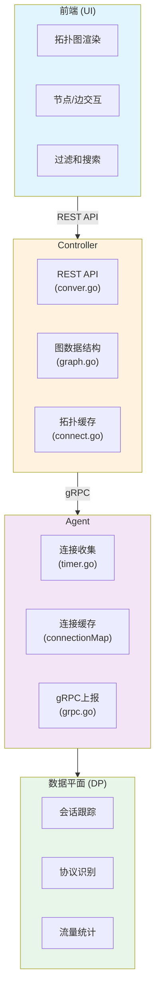
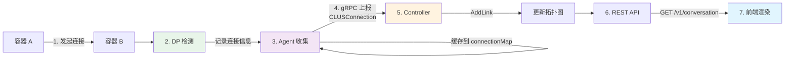
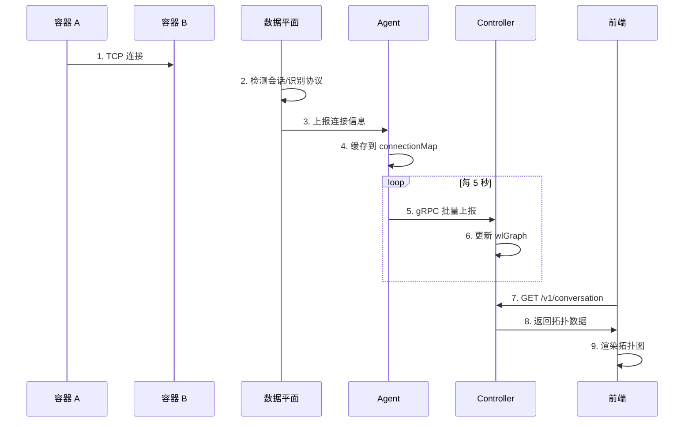

# 网络拓扑功能概述

## 一、功能简介

NeuVector 的网络拓扑功能实时展示容器间的网络通信关系，包括：
- 容器/服务之间的连接关系
- 流量统计（字节数、会话数）
- 安全状态（威胁检测、策略动作）
- 协议和应用识别

## 二、整体架构



## 三、核心组件

### 3.1 数据平面 (DP)

**功能**: 实时检测和跟踪网络连接

- 会话管理 (TCP/UDP/ICMP)
- 协议识别 (HTTP, MySQL, Redis 等)
- 流量统计 (字节数、会话数)
- 威胁检测

### 3.2 Agent

**功能**: 收集连接数据并上报给 Controller

**关键文件**:
- `agent/timer.go` - 定期收集连接
- `agent/grpc.go` - gRPC 通信

**核心机制**:
```go
// 连接缓存
var connectionMap map[string]*dp.Connection

// 定期上报 (默认 5 秒)
func putConnections() {
    // 1. 从 connectionMap 取出连接
    // 2. 转换为 CLUSConnection 格式
    // 3. 通过 gRPC 发送给 Controller
}
```

### 3.3 Controller

**功能**: 维护全局拓扑图并提供 API

**关键文件**:
- `controller/graph/graph.go` - 图数据结构
- `controller/cache/connect.go` - 拓扑管理
- `controller/rest/conver.go` - REST API

**核心机制**:
```go
// 全局拓扑图
var wlGraph *graph.Graph

// 接收 Agent 上报的连接
func UpdateConnections(conns []*share.CLUSConnection) {
    // 1. 遍历每个连接
    // 2. 添加/更新图中的边
    // 3. 更新统计信息
}
```

### 3.4 REST API

**功能**: 向前端提供拓扑数据

| 端点 | 功能 |
|------|------|
| `GET /v1/conversation_endpoint` | 获取所有端点 |
| `GET /v1/conversation` | 获取所有会话 |
| `GET /v1/conversation/:from/:to` | 获取会话详情 |

## 四、数据流





## 五、核心数据结构

### 5.1 连接数据 (Agent → Controller)

```protobuf
message CLUSConnection {
    string ClientWL = 1;      // 客户端工作负载 ID
    string ServerWL = 2;      // 服务端工作负载 ID
    bytes ClientIP = 3;       // 客户端 IP
    bytes ServerIP = 4;       // 服务端 IP
    uint32 ClientPort = 5;    // 客户端端口
    uint32 ServerPort = 6;    // 服务端端口
    uint32 IPProto = 7;       // IP 协议 (TCP/UDP)
    uint32 Application = 8;   // 应用 ID
    uint64 Bytes = 9;         // 传输字节数
    uint32 Sessions = 10;     // 会话数
    uint32 ThreatID = 14;     // 威胁 ID
    uint32 PolicyAction = 16; // 策略动作
    // ... 更多字段
}
```

### 5.2 图节点和边

```go
// 图结构
type Graph struct {
    nodes map[string]*graphNode
}

// 节点 (容器/服务)
type graphNode struct {
    ins  map[string]*graphLink  // 入站链接
    outs map[string]*graphLink  // 出站链接
}

// 链接 (连接关系)
type graphLink struct {
    ends map[string]interface{}  // 目标节点 → 属性
}
```

### 5.3 拓扑属性

```go
// 边的属性
type graphAttr struct {
    bytes        uint64                    // 总字节数
    sessions     uint32                    // 总会话数
    severity     uint8                     // 最高威胁等级
    policyAction uint8                     // 策略动作
    entries      map[graphKey]*graphEntry  // 详细条目
}

// 节点的属性
type nodeAttr struct {
    external bool    // 是否外部
    workload bool    // 是否工作负载
    host     bool    // 是否主机
    managed  bool    // 是否受管
    alias    string  // 别名
}
```

## 六、关键源码文件索引

| 层级 | 文件 | 功能 |
|------|------|------|
| Agent | `agent/timer.go:620-699` | 连接收集和上报 |
| Agent | `agent/grpc.go:271-291` | gRPC 发送连接 |
| Controller | `controller/graph/graph.go` | 图数据结构 |
| Controller | `controller/cache/connect.go` | 拓扑管理 |
| Controller | `controller/rest/conver.go` | REST API |
| API | `controller/api/apis.go:1126-1212` | 数据结构定义 |
| Proto | `share/controller_service.proto:113-153` | protobuf 定义 |

## 七、实现要点

### 7.1 高效的图存储

- 使用邻接表存储图结构
- 支持快速的节点/边查询
- 支持增量更新

### 7.2 聚合统计

- 按 (端口, 协议, 应用) 聚合
- 支持多粒度统计
- 定期重算避免实时计算开销

### 7.3 缓存机制

- Agent 端缓存连接减少上报频率
- Controller 端缓存拓扑数据减少 API 响应时间
- 支持增量更新

### 7.4 多租户隔离

- 基于命名空间的可见性控制
- 基于角色的访问控制
- 域级别的拓扑隔离
