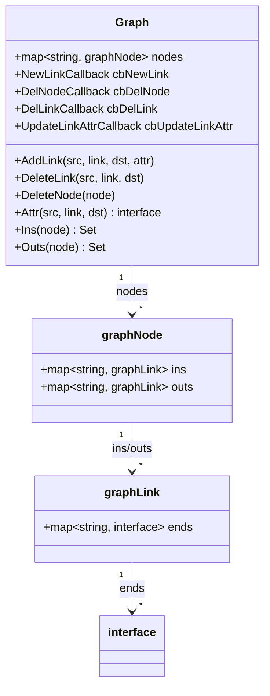
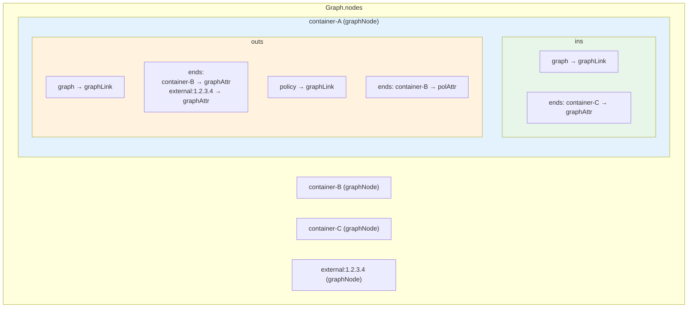

# 图数据结构实现

## 一、概述

NeuVector 使用自定义的有向图数据结构来存储网络拓扑，支持：
- 多类型链接 (policy, graph, attr)
- 带属性的边
- 高效的邻接查询
- 回调钩子机制

## 二、核心数据结构

**源码位置**: `controller/graph/graph.go`



### 2.1 图结构

```go
type Graph struct {
    nodes            map[string]*graphNode  // 节点名 → 节点
    cbNewLink        NewLinkCallback        // 新链接回调
    cbDelNode        DelNodeCallback        // 删除节点回调
    cbDelLink        DelLinkCallback        // 删除链接回调
    cbUpdateLinkAttr UpdateLinkAttrCallback // 更新属性回调
}
```

### 2.2 节点结构

```go
type graphNode struct {
    ins  map[string]*graphLink  // 入站链接: 链接类型 → 链接
    outs map[string]*graphLink  // 出站链接: 链接类型 → 链接
}
```

### 2.3 链接结构

```go
type graphLink struct {
    ends map[string]interface{}  // 目标节点名 → 边属性
}
```

### 2.4 回调类型

```go
type NewLinkCallback func(src, link, dst string)
type DelNodeCallback func(node string)
type DelLinkCallback func(src, link, dst string)
type UpdateLinkAttrCallback func(src, link, dst string)
type ConnectedNodeCallback func(node string) bool
type PurgeOutLinkCallback func(src, link, dst string, attr interface{}, param interface{}) bool
```

## 三、图的存储模型



```mermaid
flowchart LR
    subgraph 链接类型
        policy["policy<br/>策略链接"]
        graph["graph<br/>流量链接"]
        attr["attr<br/>属性链接"]
    end

    A[Container A] -->|graph| B[Container B]
    A -->|policy| B
    A -->|graph| C[External IP]
    B -->|attr| B

    style policy fill:#bbdefb
    style graph fill:#c8e6c9
    style attr fill:#ffe0b2
```

## 四、核心操作

### 4.1 创建图

```go
func NewGraph() *Graph {
    return &Graph{
        nodes: make(map[string]*graphNode),
    }
}
```

### 4.2 添加链接

**源码位置**: `controller/graph/graph.go:62-135`

```go
func (g *Graph) AddLink(src, link, dst string, attr interface{}) {
    var gn *graphNode
    var gl *graphLink
    var ok, newlink, updattr bool

    // ========== 处理源节点的出站链接 ==========
    if gn, ok = g.nodes[src]; !ok {
        // 源节点不存在，创建新节点
        gl = &graphLink{ends: make(map[string]interface{})}
        gl.ends[dst] = attr

        gn = &graphNode{
            ins:  make(map[string]*graphLink),
            outs: make(map[string]*graphLink),
        }
        gn.outs[link] = gl
        g.nodes[src] = gn
        newlink = true

    } else if gl, ok = gn.outs[link]; !ok {
        // 源节点存在，但链接类型不存在
        gl = &graphLink{ends: make(map[string]interface{})}
        gl.ends[dst] = attr
        gn.outs[link] = gl
        newlink = true

    } else if _, ok = gl.ends[dst]; !ok {
        // 链接类型存在，但目标不存在
        gl.ends[dst] = attr
        newlink = true

    } else {
        // 链接已存在，检查属性是否变化
        if !reflect.DeepEqual(gl.ends[dst], attr) {
            gl.ends[dst] = attr
            updattr = true
        }
    }

    // ========== 处理目标节点的入站链接 ==========
    // (类似逻辑，更新 dst 节点的 ins)
    if gn, ok = g.nodes[dst]; !ok {
        gl = &graphLink{ends: make(map[string]interface{})}
        gl.ends[src] = attr
        gn = &graphNode{
            ins:  make(map[string]*graphLink),
            outs: make(map[string]*graphLink),
        }
        gn.ins[link] = gl
        g.nodes[dst] = gn
        newlink = true
    }
    // ... 其他分支

    // ========== 触发回调 ==========
    if newlink && g.cbNewLink != nil {
        g.cbNewLink(src, link, dst)
    }
    if updattr && g.cbUpdateLinkAttr != nil {
        g.cbUpdateLinkAttr(src, link, dst)
    }
}
```

### 4.3 删除链接

**源码位置**: `controller/graph/graph.go:149-185`

```go
func (g *Graph) DeleteLink(src, link, dst string) {
    var s, d *graphNode
    var ok bool

    // 检查源节点和目标节点都存在
    if s, ok = g.nodes[src]; !ok {
        return
    }
    if d, ok = g.nodes[dst]; !ok {
        return
    }

    // 删除源节点的出站链接
    if gl, ok := s.outs[link]; ok {
        if _, ok = gl.ends[dst]; ok {
            delete(gl.ends, dst)
            if len(gl.ends) == 0 {
                delete(s.outs, link)
                if g.cbDelLink != nil {
                    g.cbDelLink(src, link, dst)
                }
            }
        }
    }

    // 删除目标节点的入站链接
    if gl, ok := d.ins[link]; ok {
        if _, ok = gl.ends[src]; ok {
            delete(gl.ends, src)
            if len(gl.ends) == 0 {
                delete(d.ins, link)
                if g.cbDelLink != nil {
                    g.cbDelLink(src, link, dst)
                }
            }
        }
    }
}
```

### 4.4 删除节点

**源码位置**: `controller/graph/graph.go:187-214`

```go
func (g *Graph) DeleteNode(node string) string {
    var gn *graphNode
    var ok bool

    if gn, ok = g.nodes[node]; !ok {
        return ""
    }

    // 删除所有入站链接
    for link, gl := range gn.ins {
        for n := range gl.ends {
            g.DeleteLink(n, link, node)
        }
    }

    // 删除所有出站链接
    for link, gl := range gn.outs {
        for n := range gl.ends {
            g.DeleteLink(node, link, n)
        }
    }

    // 删除节点本身
    delete(g.nodes, node)

    if g.cbDelNode != nil {
        g.cbDelNode(node)
    }

    return node
}
```

### 4.5 获取边属性

```go
func (g *Graph) Attr(src, link, dst string) interface{} {
    if s, ok := g.nodes[src]; ok {
        if gl, ok := s.outs[link]; ok {
            if attr, ok := gl.ends[dst]; ok {
                return attr
            }
        }
    }
    return nil
}
```

## 五、查询操作

### 5.1 获取入站邻居

```go
// 获取所有入站邻居
func (g *Graph) Ins(node string) utils.Set {
    if _, ok := g.nodes[node]; !ok {
        return nil
    }

    ret := utils.NewSet()
    n := g.nodes[node]
    for _, l := range n.ins {
        for v := range l.ends {
            ret.Add(v)
        }
    }
    return ret
}

// 获取特定链接类型的入站邻居
func (g *Graph) InsByLink(node string, link string) utils.Set {
    if _, ok := g.nodes[node]; !ok {
        return nil
    }

    ret := utils.NewSet()
    n := g.nodes[node]
    if gl, ok := n.ins[link]; ok {
        for v := range gl.ends {
            ret.Add(v)
        }
    }
    return ret
}
```

### 5.2 获取出站邻居

```go
// 获取所有出站邻居
func (g *Graph) Outs(node string) utils.Set {
    // ... 类似 Ins()
}

// 获取特定链接类型的出站邻居
func (g *Graph) OutsByLink(node string, link string) utils.Set {
    // ... 类似 InsByLink()
}
```

### 5.3 获取双向邻居

```go
func (g *Graph) Both(node string) utils.Set {
    if _, ok := g.nodes[node]; !ok {
        return nil
    }
    return g.Ins(node).Union(g.Outs(node))
}

func (g *Graph) BothByLink(node string, link string) utils.Set {
    if _, ok := g.nodes[node]; !ok {
        return nil
    }
    return g.InsByLink(node, link).Union(g.OutsByLink(node, link))
}
```

### 5.4 获取两点间的链接

```go
func (g *Graph) BetweenDirLinks(src string, dst string) map[string]interface{} {
    ret := make(map[string]interface{})
    if n, ok := g.nodes[src]; ok {
        for ln, l := range n.outs {
            if attr, ok := l.ends[dst]; ok {
                ret[ln] = attr
            }
        }
    }
    return ret
}
```

## 六、图遍历

### 6.1 连通分量 (BFS)

**源码位置**: `controller/graph/graph.go:364-389`

```go
func (g *Graph) Connected(node string, cb ConnectedNodeCallback) utils.Set {
    if _, ok := g.nodes[node]; !ok {
        return nil
    }

    ret := utils.NewSet()
    ret.Add(node)
    q := []string{node}

    // BFS 遍历
    for len(q) > 0 {
        // 出队
        node, q = q[0], q[1:]

        // 获取所有邻居
        both := g.Both(node)
        for n := range both.Iter() {
            // 调用回调检查是否继续
            if cb != nil && cb(n.(string)) {
                if !ret.Contains(n) {
                    ret.Add(n)
                    q = append(q, n.(string))
                }
            }
        }
    }

    return ret
}
```

### 6.2 按链接类型遍历

```go
func (g *Graph) ConnectedByLink(node string, link string, cb ConnectedNodeCallback) utils.Set {
    // 类似 Connected()，但只遍历特定类型的链接
    // ...
}
```

## 七、批量操作

### 7.1 获取所有节点

```go
func (g *Graph) All() utils.Set {
    ret := utils.NewSet()
    for v := range g.nodes {
        ret.Add(v)
    }
    return ret
}
```

### 7.2 获取无入站链接的节点

```go
func (g *Graph) NoIn() utils.Set {
    ret := utils.NewSet()
    for v, n := range g.nodes {
        if len(n.ins) == 0 {
            ret.Add(v)
        }
    }
    return ret
}

func (g *Graph) NoInByLink(link string) utils.Set {
    ret := utils.NewSet()
    for v, n := range g.nodes {
        if _, ok := n.ins[link]; !ok {
            ret.Add(v)
        } else if len(n.ins[link].ends) == 0 {
            ret.Add(v)
        }
    }
    return ret
}
```

### 7.3 清除出站链接

```go
func (g *Graph) PurgeOutLinks(src string, cb PurgeOutLinkCallback, param interface{}) {
    if n, ok := g.nodes[src]; ok {
        for ln, l := range n.outs {
            for dst, attr := range l.ends {
                // 回调返回 true 则删除
                if cb(src, ln, dst, attr, param) {
                    delete(l.ends, dst)
                    if len(l.ends) == 0 {
                        delete(n.outs, ln)
                    }
                }
            }
        }
    }
}
```

## 八、链接类型

NeuVector 使用多种链接类型：

```go
const (
    policyLink = "policy"  // 策略链接 (策略允许的通信)
    graphLink  = "graph"   // 流量链接 (实际发生的通信)
    attrLink   = "attr"    // 属性链接 (节点属性)
)
```

## 九、简化实现示例

```go
package graph

import "sync"

type Graph struct {
    nodes map[string]*Node
    mu    sync.RWMutex
}

type Node struct {
    ID   string
    Ins  map[string]map[string]interface{} // linkType -> dstNode -> attr
    Outs map[string]map[string]interface{} // linkType -> dstNode -> attr
}

type Edge struct {
    From string
    To   string
    Type string
    Attr interface{}
}

func New() *Graph {
    return &Graph{
        nodes: make(map[string]*Node),
    }
}

func (g *Graph) AddEdge(from, to, linkType string, attr interface{}) {
    g.mu.Lock()
    defer g.mu.Unlock()

    // 确保源节点存在
    if _, ok := g.nodes[from]; !ok {
        g.nodes[from] = &Node{
            ID:   from,
            Ins:  make(map[string]map[string]interface{}),
            Outs: make(map[string]map[string]interface{}),
        }
    }

    // 确保目标节点存在
    if _, ok := g.nodes[to]; !ok {
        g.nodes[to] = &Node{
            ID:   to,
            Ins:  make(map[string]map[string]interface{}),
            Outs: make(map[string]map[string]interface{}),
        }
    }

    // 添加出站边
    src := g.nodes[from]
    if src.Outs[linkType] == nil {
        src.Outs[linkType] = make(map[string]interface{})
    }
    src.Outs[linkType][to] = attr

    // 添加入站边
    dst := g.nodes[to]
    if dst.Ins[linkType] == nil {
        dst.Ins[linkType] = make(map[string]interface{})
    }
    dst.Ins[linkType][from] = attr
}

func (g *Graph) RemoveEdge(from, to, linkType string) {
    g.mu.Lock()
    defer g.mu.Unlock()

    if src, ok := g.nodes[from]; ok {
        if edges, ok := src.Outs[linkType]; ok {
            delete(edges, to)
        }
    }

    if dst, ok := g.nodes[to]; ok {
        if edges, ok := dst.Ins[linkType]; ok {
            delete(edges, from)
        }
    }
}

func (g *Graph) GetOutNeighbors(node, linkType string) []string {
    g.mu.RLock()
    defer g.mu.RUnlock()

    var result []string
    if n, ok := g.nodes[node]; ok {
        if edges, ok := n.Outs[linkType]; ok {
            for dst := range edges {
                result = append(result, dst)
            }
        }
    }
    return result
}

func (g *Graph) GetInNeighbors(node, linkType string) []string {
    g.mu.RLock()
    defer g.mu.RUnlock()

    var result []string
    if n, ok := g.nodes[node]; ok {
        if edges, ok := n.Ins[linkType]; ok {
            for src := range edges {
                result = append(result, src)
            }
        }
    }
    return result
}

func (g *Graph) GetEdgeAttr(from, to, linkType string) interface{} {
    g.mu.RLock()
    defer g.mu.RUnlock()

    if src, ok := g.nodes[from]; ok {
        if edges, ok := src.Outs[linkType]; ok {
            return edges[to]
        }
    }
    return nil
}

func (g *Graph) GetAllNodes() []string {
    g.mu.RLock()
    defer g.mu.RUnlock()

    result := make([]string, 0, len(g.nodes))
    for id := range g.nodes {
        result = append(result, id)
    }
    return result
}

func (g *Graph) GetAllEdges(linkType string) []*Edge {
    g.mu.RLock()
    defer g.mu.RUnlock()

    var result []*Edge
    for from, node := range g.nodes {
        if edges, ok := node.Outs[linkType]; ok {
            for to, attr := range edges {
                result = append(result, &Edge{
                    From: from,
                    To:   to,
                    Type: linkType,
                    Attr: attr,
                })
            }
        }
    }
    return result
}
```

## 十、关键要点

1. **邻接表存储**: 使用 map 实现，支持 O(1) 的节点查找
2. **双向索引**: 同时维护入站和出站链接，支持快速邻居查询
3. **多类型链接**: 支持不同类型的边 (policy/graph/attr)
4. **带属性边**: 每条边可以携带任意属性
5. **回调机制**: 支持新增/删除节点和边的回调
6. **线程安全**: 外部通过 graphMutex 保护
