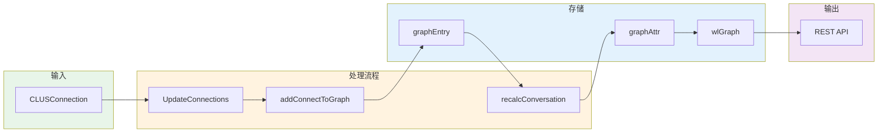
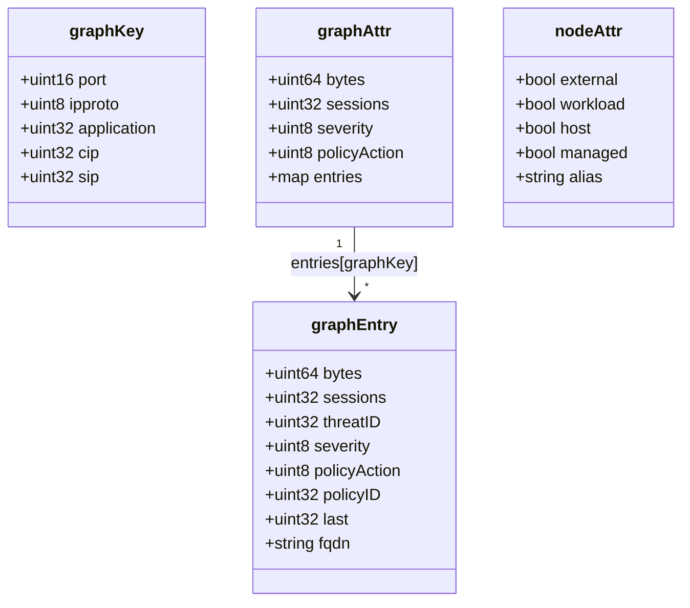

# 拓扑数据管理和统计

## 一、概述

拓扑数据管理负责：
- 接收并存储连接数据到图中
- 聚合统计流量信息
- 管理节点属性
- 提供拓扑查询接口



## 二、核心数据结构

**源码位置**: `controller/cache/connect.go:51-103`



### 2.1 图条目 (graphEntry)

存储单个连接的详细信息：

```go
type graphEntry struct {
    bytes        uint64   // 传输字节数
    sessions     uint32   // 会话数
    server       uint32   // 服务端标识
    threatID     uint32   // 威胁 ID
    dlpID        uint32   // DLP 规则 ID
    wafID        uint32   // WAF 规则 ID
    mappedPort   uint16   // 映射端口
    severity     uint8    // 威胁等级
    dlpSeverity  uint8    // DLP 威胁等级
    wafSeverity  uint8    // WAF 威胁等级
    policyAction uint8    // 策略动作
    policyID     uint32   // 策略 ID
    last         uint32   // 最后见时间
    xff          uint8    // XFF 标志
    toSidecar    uint8    // Sidecar 标志
    fqdn         string   // 服务端域名
    nbe          uint8    // 跨命名空间标志
}
```

### 2.2 图键 (graphKey)

用于索引不同维度的连接：

```go
type graphKey struct {
    port        uint16   // 服务端口
    ipproto     uint8    // IP 协议 (TCP/UDP)
    application uint32   // 应用 ID
    cip         uint32   // 客户端 IP (hash)
    sip         uint32   // 服务端 IP (hash)
}
```

### 2.3 图属性 (graphAttr)

存储两个端点间的聚合统计：

```go
type graphAttr struct {
    bytes        uint64                    // 总字节数
    sessions     uint32                    // 总会话数
    severity     uint8                     // 最高威胁等级
    policyAction uint8                     // 策略动作
    entries      map[graphKey]*graphEntry  // 详细条目
}
```

### 2.4 节点属性 (nodeAttr)

存储端点的属性信息：

```go
type nodeAttr struct {
    external bool    // 是否外部 IP
    workload bool    // 是否工作负载
    host     bool    // 是否主机
    managed  bool    // 是否受管
    addrgrp  bool    // 是否地址组
    ipsvcgrp bool    // 是否 IP 服务组
    hostID   string  // 主机 ID
    alias    string  // 别名
}
```

## 三、全局拓扑图

```go
// 全局图实例
var wlGraph *graph.Graph

// 图操作锁
var graphMutex sync.RWMutex

// 初始化
func initGraph() {
    wlGraph = graph.NewGraph()
    wlGraph.RegisterNewLinkHook(onNewLink)
    wlGraph.RegisterDelNodeHook(onDelNode)
    wlGraph.RegisterDelLinkHook(onDelLink)
}
```

## 四、连接添加流程

### 4.1 UpdateConnections

**源码位置**: `controller/cache/connect.go:762-856`

```go
func UpdateConnections(conns []*share.CLUSConnection) {
    graphMutex.Lock()
    defer graphMutex.Unlock()

    for _, conn := range conns {
        // 1. 确定端点 ID
        fromID := getEndpointID(conn.ClientWL, conn.ClientIP)
        toID := getEndpointID(conn.ServerWL, conn.ServerIP)

        // 2. 跳过自连接
        if fromID == toID {
            continue
        }

        // 3. 添加连接到图
        addConnectToGraph(fromID, toID, conn)

        // 4. 记录违规日志
        if isViolation(conn) {
            logViolation(conn)
        }

        // 5. 记录威胁日志
        if conn.ThreatID != 0 {
            logThreat(conn)
        }
    }

    // 标记需要重新计算
    policyUpdated = true
}
```

### 4.2 addConnectToGraph

```go
func addConnectToGraph(from, to string, conn *share.CLUSConnection) {
    // 1. 获取或创建边属性
    attr := wlGraph.Attr(from, graphLink, to)
    var gAttr *graphAttr

    if attr == nil {
        gAttr = &graphAttr{
            entries: make(map[graphKey]*graphEntry),
        }
    } else {
        gAttr = attr.(*graphAttr)
    }

    // 2. 创建条目键
    key := graphKey{
        port:        uint16(conn.ServerPort),
        ipproto:     uint8(conn.IPProto),
        application: conn.Application,
        cip:         ipHash(conn.ClientIP),
        sip:         ipHash(conn.ServerIP),
    }

    // 3. 更新或创建条目
    if entry, ok := gAttr.entries[key]; ok {
        // 更新现有条目
        entry.bytes += conn.Bytes
        entry.sessions += conn.Sessions
        entry.last = conn.LastSeenAt
        if conn.Severity > entry.severity {
            entry.severity = uint8(conn.Severity)
            entry.threatID = conn.ThreatID
        }
        updatePolicyAction(entry, conn)
    } else {
        // 创建新条目
        gAttr.entries[key] = &graphEntry{
            bytes:        conn.Bytes,
            sessions:     conn.Sessions,
            severity:     uint8(conn.Severity),
            threatID:     conn.ThreatID,
            policyAction: uint8(conn.PolicyAction),
            policyID:     conn.PolicyId,
            last:         conn.LastSeenAt,
            fqdn:         conn.FQDN,
            mappedPort:   uint16(conn.MappedPort),
            xff:          boolToUint8(conn.Xff),
            toSidecar:    boolToUint8(conn.ToSidecar),
            nbe:          boolToUint8(conn.Nbe),
        }
    }

    // 4. 重新计算聚合统计
    recalcConversation(gAttr)

    // 5. 添加/更新边
    wlGraph.AddLink(from, graphLink, to, gAttr)

    // 6. 更新节点属性
    ensureNodeAttr(from, conn, true)   // 客户端
    ensureNodeAttr(to, conn, false)    // 服务端
}
```

### 4.3 重新计算会话统计

**源码位置**: `controller/cache/connect.go:390-430`

```go
func recalcConversation(attr *graphAttr) {
    var totalBytes uint64
    var totalSessions uint32
    var maxSeverity uint8
    var maxPolicyAction uint8

    for _, entry := range attr.entries {
        totalBytes += entry.bytes
        totalSessions += entry.sessions

        if entry.severity > maxSeverity {
            maxSeverity = entry.severity
        }

        // 策略动作优先级: DENY > VIOLATE > ALLOW > OPEN
        if entry.policyAction > maxPolicyAction {
            maxPolicyAction = entry.policyAction
        }
    }

    attr.bytes = totalBytes
    attr.sessions = totalSessions
    attr.severity = maxSeverity
    attr.policyAction = maxPolicyAction
}
```

## 五、端点 ID 生成

### 5.1 端点 ID 格式

```go
// 工作负载端点
"nv.workload.xxx"

// 主机端点
"nv.host.xxx"

// 外部 IP 端点
"nv.ip.1.2.3.4"

// 地址组端点
"nv.addrgrp.xxx"
```

### 5.2 getEndpointID

```go
func getEndpointID(wlID string, ip []byte) string {
    if wlID != "" {
        return wlID
    }

    // 外部 IP
    ipStr := net.IP(ip).String()
    return fmt.Sprintf("%s%s", api.LearnedWorkloadPrefix, ipStr)
}
```

## 六、节点属性管理

### 6.1 确保节点属性存在

```go
func ensureNodeAttr(id string, conn *share.CLUSConnection, isClient bool) {
    attr := wlGraph.Attr(id, attrLink, id)
    var nAttr *nodeAttr

    if attr == nil {
        nAttr = &nodeAttr{}

        // 判断节点类型
        if strings.HasPrefix(id, api.LearnedWorkloadPrefix) {
            nAttr.external = true
        } else if strings.HasPrefix(id, api.LearnedHostPrefix) {
            nAttr.host = true
        } else {
            nAttr.workload = true
            nAttr.managed = true
        }

        wlGraph.AddLink(id, attrLink, id, nAttr)
    }
}
```

### 6.2 设置节点别名

```go
func SetEndpointAlias(id, alias string) error {
    graphMutex.Lock()
    defer graphMutex.Unlock()

    attr := wlGraph.Attr(id, attrLink, id)
    if attr == nil {
        return fmt.Errorf("endpoint not found: %s", id)
    }

    nAttr := attr.(*nodeAttr)
    nAttr.alias = alias

    return nil
}
```

## 七、拓扑查询

### 7.1 获取所有端点

**源码位置**: `controller/cache/connect.go:2000+`

```go
func GetAllConverEndpoints(view string, acc *access.AccessControl) []*api.RESTConversationEndpoint {
    graphMutex.RLock()
    defer graphMutex.RUnlock()

    var eps []*api.RESTConversationEndpoint

    // 遍历所有节点
    nodes := wlGraph.All()
    for node := range nodes.Iter() {
        id := node.(string)

        // 获取节点属性
        attr := wlGraph.Attr(id, attrLink, id)
        if attr == nil {
            continue
        }
        nAttr := attr.(*nodeAttr)

        // 检查访问权限
        if !acc.CanAccessEndpoint(id) {
            continue
        }

        // 构建 REST 响应
        ep := nodeAttr2REST(id, nAttr)
        eps = append(eps, ep)
    }

    return eps
}
```

### 7.2 获取所有会话

**源码位置**: `controller/cache/connect.go:2128-2227`

```go
func GetAllApplicationConvers(groupFilter, domainFilter string,
    acc *access.AccessControl) ([]*api.RESTConversationCompact, []*api.RESTConversationEndpoint) {

    graphMutex.RLock()
    defer graphMutex.RUnlock()

    var convers []*api.RESTConversationCompact
    var endpoints []*api.RESTConversationEndpoint
    endpointSet := make(map[string]bool)

    // 遍历所有节点
    nodes := wlGraph.All()
    for node := range nodes.Iter() {
        id := node.(string)

        // 检查访问权限
        if !acc.CanAccessEndpoint(id) {
            continue
        }

        // 获取出站邻居
        outs := wlGraph.OutsByLink(id, graphLink)
        for out := range outs.Iter() {
            toID := out.(string)

            // 检查目标访问权限
            if !acc.CanAccessEndpoint(toID) {
                continue
            }

            // 获取边属性
            attr := wlGraph.Attr(id, graphLink, toID)
            if attr == nil {
                continue
            }
            gAttr := attr.(*graphAttr)

            // 构建 REST 响应
            conver := &api.RESTConversationCompact{
                From: id,
                To:   toID,
                RESTConversationReport: graphAttr2REST(gAttr),
            }
            convers = append(convers, conver)

            // 记录端点
            endpointSet[id] = true
            endpointSet[toID] = true
        }
    }

    // 构建端点列表
    for epID := range endpointSet {
        attr := wlGraph.Attr(epID, attrLink, epID)
        if attr != nil {
            ep := nodeAttr2REST(epID, attr.(*nodeAttr))
            endpoints = append(endpoints, ep)
        }
    }

    return convers, endpoints
}
```

### 7.3 获取会话详情

```go
func GetApplicationConver(from, to string, acc *access.AccessControl) (*api.RESTConversationDetail, error) {
    graphMutex.RLock()
    defer graphMutex.RUnlock()

    // 检查访问权限
    if !acc.CanAccessEndpoint(from) || !acc.CanAccessEndpoint(to) {
        return nil, errors.New("access denied")
    }

    // 获取边属性
    attr := wlGraph.Attr(from, graphLink, to)
    if attr == nil {
        return nil, errors.New("conversation not found")
    }
    gAttr := attr.(*graphAttr)

    // 构建详情响应
    detail := &api.RESTConversationDetail{
        RESTConversation: &api.RESTConversation{
            From:   getEndpointREST(from),
            To:     getEndpointREST(to),
            RESTConversationReport: graphAttr2REST(gAttr),
        },
        Entries: make([]*api.RESTConversationEntry, 0),
    }

    // 添加详细条目
    for key, entry := range gAttr.entries {
        detail.Entries = append(detail.Entries, graphEntry2REST(key, entry))
    }

    return detail, nil
}
```

## 八、数据转换

### 8.1 graphAttr2REST

**源码位置**: `controller/cache/connect.go:1694-1782`

```go
func graphAttr2REST(attr *graphAttr) *api.RESTConversationReport {
    report := &api.RESTConversationReport{
        Bytes:        attr.bytes,
        Sessions:     attr.sessions,
        Severity:     severityString(attr.severity),
        PolicyAction: policyActionString(attr.policyAction),
        Protos:       make([]string, 0),
        Apps:         make([]string, 0),
        Ports:        make([]string, 0),
        Entries:      make([]*api.RESTConversationReportEntry, 0),
    }

    // 收集唯一的协议、应用、端口
    protoSet := make(map[uint8]bool)
    appSet := make(map[uint32]bool)
    portSet := make(map[uint16]bool)

    for key, entry := range attr.entries {
        protoSet[key.ipproto] = true
        appSet[key.application] = true
        portSet[key.port] = true

        // 添加条目
        report.Entries = append(report.Entries, &api.RESTConversationReportEntry{
            Bytes:        entry.bytes,
            Sessions:     entry.sessions,
            Port:         portString(key.port, key.ipproto),
            Application:  appString(key.application),
            PolicyAction: policyActionString(entry.policyAction),
            LastSeenAt:   int64(entry.last),
        })
    }

    // 转换集合为列表
    for proto := range protoSet {
        report.Protos = append(report.Protos, protoString(proto))
    }
    for app := range appSet {
        report.Apps = append(report.Apps, appString(app))
    }
    for port := range portSet {
        report.Ports = append(report.Ports, fmt.Sprintf("%d", port))
    }

    return report
}
```

### 8.2 nodeAttr2REST

```go
func nodeAttr2REST(id string, attr *nodeAttr) *api.RESTConversationEndpoint {
    ep := &api.RESTConversationEndpoint{
        ID: id,
    }

    if attr.alias != "" {
        ep.DisplayName = attr.alias
    } else {
        ep.DisplayName = getDisplayName(id)
    }

    if attr.workload {
        ep.Kind = "container"
        // 获取工作负载详细信息
        if wl := getWorkload(id); wl != nil {
            ep.Name = wl.Name
            ep.Domain = wl.Domain
            ep.Service = wl.Service
            ep.PolicyMode = wl.PolicyMode
        }
    } else if attr.host {
        ep.Kind = "host"
        ep.Name = getHostName(id)
    } else if attr.external {
        ep.Kind = "external"
        ep.Name = id
    }

    return ep
}
```

## 九、简化实现示例

```go
package topology

import (
    "sync"
    "time"
)

type TopologyManager struct {
    graph     *Graph
    mu        sync.RWMutex
}

type Edge struct {
    From       string
    To         string
    Bytes      uint64
    Sessions   uint32
    LastSeen   time.Time
    Protocols  map[string]bool
    Apps       map[string]bool
    Ports      map[uint16]bool
}

type Node struct {
    ID       string
    Type     string  // "container", "host", "external"
    Name     string
    Alias    string
}

func NewTopologyManager() *TopologyManager {
    return &TopologyManager{
        graph: New(),
    }
}

// 添加连接
func (m *TopologyManager) AddConnection(conn *Connection) {
    m.mu.Lock()
    defer m.mu.Unlock()

    // 获取或创建边
    attr := m.graph.GetEdgeAttr(conn.ClientID, conn.ServerID, "graph")
    var edge *Edge

    if attr == nil {
        edge = &Edge{
            From:      conn.ClientID,
            To:        conn.ServerID,
            Protocols: make(map[string]bool),
            Apps:      make(map[string]bool),
            Ports:     make(map[uint16]bool),
        }
    } else {
        edge = attr.(*Edge)
    }

    // 更新统计
    edge.Bytes += conn.Bytes
    edge.Sessions += conn.Sessions
    edge.LastSeen = conn.LastSeen
    edge.Protocols[conn.Protocol] = true
    edge.Apps[conn.Application] = true
    edge.Ports[conn.ServerPort] = true

    // 保存
    m.graph.AddEdge(conn.ClientID, conn.ServerID, "graph", edge)
}

// 获取所有边
func (m *TopologyManager) GetAllEdges() []*Edge {
    m.mu.RLock()
    defer m.mu.RUnlock()

    edges := m.graph.GetAllEdges("graph")
    result := make([]*Edge, len(edges))

    for i, e := range edges {
        result[i] = e.Attr.(*Edge)
    }

    return result
}

// 获取所有节点
func (m *TopologyManager) GetAllNodes() []*Node {
    m.mu.RLock()
    defer m.mu.RUnlock()

    nodeIDs := m.graph.GetAllNodes()
    result := make([]*Node, len(nodeIDs))

    for i, id := range nodeIDs {
        attr := m.graph.GetEdgeAttr(id, id, "attr")
        if attr != nil {
            result[i] = attr.(*Node)
        } else {
            result[i] = &Node{ID: id, Type: "unknown"}
        }
    }

    return result
}

// 获取两点间的边
func (m *TopologyManager) GetEdge(from, to string) *Edge {
    m.mu.RLock()
    defer m.mu.RUnlock()

    attr := m.graph.GetEdgeAttr(from, to, "graph")
    if attr != nil {
        return attr.(*Edge)
    }
    return nil
}
```

## 十、关键要点

1. **多层聚合**: 按 (端口, 协议, 应用, IP) 多维度聚合
2. **增量更新**: 只更新变化的部分，避免全量重算
3. **读写分离**: 使用读写锁优化并发性能
4. **延迟计算**: 聚合统计在需要时重新计算
5. **权限控制**: 查询时检查访问权限
