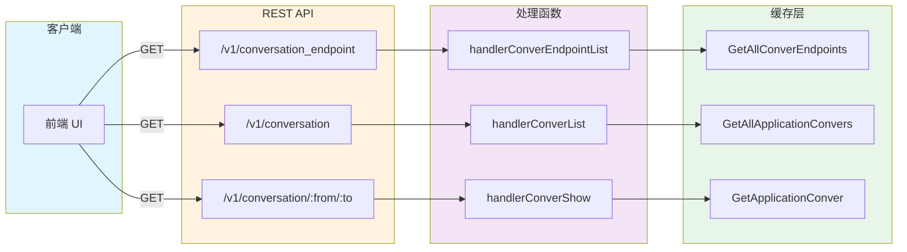
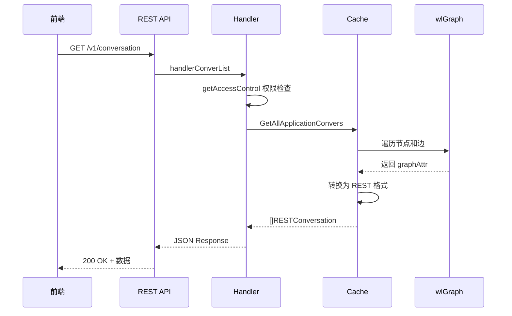

# REST API 接口定义

## 一、概述

NeuVector 提供一组 REST API 用于获取和管理网络拓扑数据，包括端点列表、会话列表和会话详情。





## 二、API 端点总览

| 方法 | 端点 | 功能 |
|------|------|------|
| GET | `/v1/conversation_endpoint` | 获取所有拓扑端点 |
| PATCH | `/v1/conversation_endpoint/:id` | 配置端点别名 |
| DELETE | `/v1/conversation_endpoint/:id` | 删除端点 |
| GET | `/v1/conversation` | 获取所有会话列表 |
| GET | `/v1/conversation/:from/:to` | 获取特定会话详情 |
| DELETE | `/v1/conversation` | 删除所有会话 |
| DELETE | `/v1/conversation/:from/:to` | 删除特定会话 |

## 三、API 详细定义

### 3.1 获取端点列表

**端点**: `GET /v1/conversation_endpoint`

**源码位置**: `controller/rest/conver.go:20-78`

**查询参数**:
| 参数 | 类型 | 说明 |
|------|------|------|
| view | string | 视图模式 (pod) |
| start | int | 分页起始位置 |
| limit | int | 返回数量限制 |

**响应结构**:
```json
{
    "endpoints": [
        {
            "id": "nv.workload.xxx",
            "display_name": "web-frontend",
            "kind": "container",
            "name": "web-frontend-abc123",
            "domain": "default",
            "service": "web-frontend",
            "policy_mode": "Protect",
            "state": "running"
        },
        {
            "id": "nv.ip.1.2.3.4",
            "display_name": "1.2.3.4",
            "kind": "external",
            "name": "1.2.3.4"
        }
    ]
}
```

**处理函数**:
```go
func handlerConverEndpointList(w http.ResponseWriter, r *http.Request, ps httprouter.Params) {
    acc, login := getAccessControl(w, r, "")
    if acc == nil {
        return
    }

    query := restParseQuery(r)

    var view string
    if value, ok := query.pairs[api.QueryKeyView]; ok && value == api.QueryValueViewPod {
        view = api.QueryValueViewPod
    }

    var resp api.RESTConversationEndpointData
    resp.Endpoints = make([]*api.RESTConversationEndpoint, 0)

    // 获取所有端点
    eps := cacher.GetAllConverEndpoints(view, acc)

    // 分页和过滤
    if len(query.filters) > 0 {
        var dummy api.RESTConversationEndpoint
        rf := restNewFilter(&dummy, query.filters)

        for _, ep := range eps[query.start:] {
            if !rf.Filter(ep) {
                continue
            }
            resp.Endpoints = append(resp.Endpoints, ep)
            if query.limit > 0 && len(resp.Endpoints) >= query.limit {
                break
            }
        }
    } else if query.limit == 0 {
        resp.Endpoints = eps[query.start:]
    } else {
        end := min(query.start+query.limit, len(eps))
        resp.Endpoints = eps[query.start:end]
    }

    restRespSuccess(w, r, &resp, acc, login, nil, "Get conversation endpoint list")
}
```

### 3.2 配置端点别名

**端点**: `PATCH /v1/conversation_endpoint/:id`

**源码位置**: `controller/rest/conver.go:111-157`

**请求体**:
```json
{
    "config": {
        "display_name": "My Custom Name"
    }
}
```

**响应**: 成功返回 200 OK

**处理函数**:
```go
func handlerConverEndpointConfig(w http.ResponseWriter, r *http.Request, ps httprouter.Params) {
    acc, login := getAccessControl(w, r, "")
    if acc == nil {
        return
    }

    id := ps.ByName("id")

    // 只允许修改主机和非托管容器
    if !strings.HasPrefix(id, api.LearnedHostPrefix) &&
        !strings.HasPrefix(id, api.LearnedWorkloadPrefix) {
        restRespErrorMessage(w, http.StatusBadRequest, api.RESTErrInvalidRequest,
            "Only host and unmanaged container can be modified!")
        return
    }

    // 检查端点是否存在
    ep, err := cacher.GetConverEndpoint(id, acc)
    if ep == nil {
        restRespNotFoundLogAccessDenied(w, login, err)
        return
    }

    // 解析请求
    body, _ := io.ReadAll(r.Body)
    var rconf api.RESTConversationEndpointConfigData
    json.Unmarshal(body, &rconf)

    if rconf.Config.DisplayName != nil {
        // 广播更新到所有 Controller
        ops := &share.CLUSGraphOps{
            Endpoint: id,
            Alias:    *rconf.Config.DisplayName,
        }
        mcastAllController(rpc.SetEndpointAlias, ops)
    }

    restRespSuccess(w, r, nil, acc, login, nil, "Configure conversation endpoint")
}
```

### 3.3 获取会话列表

**端点**: `GET /v1/conversation`

**源码位置**: `controller/rest/conver.go:158-240`

**查询参数**:
| 参数 | 类型 | 说明 |
|------|------|------|
| group | string | 按组过滤 |
| domain | string | 按域过滤 |
| verbose | bool | 是否返回详细信息 |

**响应结构** (compact):
```json
{
    "endpoints": [...],
    "conversations": [
        {
            "from": "nv.workload.xxx",
            "to": "nv.workload.yyy",
            "bytes": 1234567,
            "sessions": 100,
            "severity": "medium",
            "policy_action": "allow",
            "protocols": ["TCP"],
            "applications": ["HTTP"],
            "ports": ["80", "443"]
        }
    ]
}
```

**响应结构** (verbose):
```json
{
    "endpoints": [...],
    "conversations": [
        {
            "from": {
                "id": "nv.workload.xxx",
                "display_name": "web-frontend",
                ...
            },
            "to": {
                "id": "nv.workload.yyy",
                "display_name": "api-backend",
                ...
            },
            "bytes": 1234567,
            "sessions": 100,
            ...
        }
    ]
}
```

**处理函数**:
```go
func handlerConverList(w http.ResponseWriter, r *http.Request, ps httprouter.Params) {
    acc, login := getAccessControl(w, r, "")
    if acc == nil {
        return
    }

    query := restParseQuery(r)

    // 获取过滤参数
    var groupFilter, domainFilter string
    if value, ok := query.pairs[api.QueryKeyGroup]; ok {
        groupFilter = value
    }
    if value, ok := query.pairs[api.QueryKeyDomain]; ok {
        domainFilter = value
    }

    // 获取会话和端点
    convers, eps := cacher.GetAllApplicationConvers(groupFilter, domainFilter, acc)

    // 根据 verbose 参数决定响应格式
    if _, ok := query.pairs[api.QueryKeyVerbose]; ok {
        var resp api.RESTConversationsVerboseData
        resp.Endpoints = eps
        resp.Convers = make([]*api.RESTConversation, len(convers))

        for i, c := range convers {
            resp.Convers[i] = &api.RESTConversation{
                From:   getEndpointByID(c.From),
                To:     getEndpointByID(c.To),
                RESTConversationReport: c.RESTConversationReport,
            }
        }
        restRespSuccess(w, r, &resp, acc, login, nil, "Get conversation list")
    } else {
        var resp api.RESTConversationsData
        resp.Endpoints = eps
        resp.Convers = convers
        restRespSuccess(w, r, &resp, acc, login, nil, "Get conversation list")
    }
}
```

### 3.4 获取会话详情

**端点**: `GET /v1/conversation/:from/:to`

**源码位置**: `controller/rest/conver.go:242-300`

**响应结构**:
```json
{
    "conversation": {
        "from": {
            "id": "nv.workload.xxx",
            "display_name": "web-frontend",
            ...
        },
        "to": {
            "id": "nv.workload.yyy",
            "display_name": "api-backend",
            ...
        },
        "bytes": 1234567,
        "sessions": 100,
        "severity": "medium",
        "policy_action": "allow",
        "protocols": ["TCP"],
        "applications": ["HTTP"],
        "ports": ["80", "443"],
        "entries": [
            {
                "bytes": 123456,
                "sessions": 50,
                "port": "tcp/80",
                "mapped_port": "tcp/8080",
                "application": "HTTP",
                "Server": "nginx",
                "threat_name": "",
                "severity": "",
                "policy_action": "allow",
                "policy_id": 1001,
                "last_seen_at": "2024-01-01T00:00:00Z",
                "client_ip": "10.0.0.1",
                "server_ip": "10.0.0.2",
                "fqdn": "api.example.com",
                "xff": false,
                "to_sidecar": false,
                "nbe": false
            }
        ]
    }
}
```

**处理函数**:
```go
func handlerConverShow(w http.ResponseWriter, r *http.Request, ps httprouter.Params) {
    acc, login := getAccessControl(w, r, "")
    if acc == nil {
        return
    }

    from := ps.ByName("from")
    to := ps.ByName("to")

    // 解析查询参数 (支持批量查询)
    var srcList, dstList []string
    body, _ := io.ReadAll(r.Body)
    if len(body) > 0 {
        var query api.RESTConversationQueryData
        json.Unmarshal(body, &query)
        if query.Query != nil {
            srcList = query.Query.From
            dstList = query.Query.To
        }
    }

    // 获取会话详情
    detail, err := cacher.GetApplicationConver(from, to, srcList, dstList, acc)
    if err != nil {
        restRespNotFoundLogAccessDenied(w, login, err)
        return
    }

    var resp api.RESTConversationsDetailData
    resp.Conver = detail

    restRespSuccess(w, r, &resp, acc, login, nil, "Get conversation")
}
```

### 3.5 删除会话

**端点**: `DELETE /v1/conversation/:from/:to`

**源码位置**: `controller/rest/conver.go:302-350`

**处理函数**:
```go
func handlerConverDelete(w http.ResponseWriter, r *http.Request, ps httprouter.Params) {
    acc, login := getAccessControl(w, r, "")
    if acc == nil {
        return
    }

    from := ps.ByName("from")
    to := ps.ByName("to")

    // 检查权限
    if !acc.CanWriteCluster() {
        restRespAccessDenied(w, login)
        return
    }

    // 广播删除到所有 Controller
    ops := &share.CLUSGraphOps{
        From: from,
        To:   to,
    }
    mcastAllController(rpc.DeleteConversation, ops)

    restRespSuccess(w, r, nil, acc, login, nil, "Delete conversation")
}
```

## 四、数据结构定义

**源码位置**: `controller/api/apis.go:1126-1212`

### 4.1 端点结构

```go
type RESTConversationEndpoint struct {
    ID          string `json:"id"`
    DisplayName string `json:"display_name"`
    Kind        string `json:"kind"`           // container, host, external, address
    Name        string `json:"name,omitempty"`
    Domain      string `json:"domain,omitempty"`
    Service     string `json:"service,omitempty"`
    ServiceMesh bool   `json:"service_mesh,omitempty"`
    PolicyMode  string `json:"policy_mode,omitempty"`
    State       string `json:"state,omitempty"`
    PlatformRole string `json:"platform_role,omitempty"`
}

type RESTConversationEndpointConfig struct {
    DisplayName *string `json:"display_name,omitempty"`
}

type RESTConversationEndpointConfigData struct {
    Config *RESTConversationEndpointConfig `json:"config"`
}
```

### 4.2 会话报告结构

```go
type RESTConversationReportEntry struct {
    Bytes        uint64 `json:"bytes"`
    Sessions     uint32 `json:"sessions"`
    Port         string `json:"port,omitempty"`
    Application  string `json:"application,omitempty"`
    PolicyAction string `json:"policy_action"`
    CIP          string `json:"client_ip,omitempty"`
    SIP          string `json:"server_ip,omitempty"`
    FQDN         string `json:"fqdn,omitempty"`
    LastSeenAt   int64  `json:"last_seen_at"`
}

type RESTConversationReport struct {
    Bytes        uint64                         `json:"bytes"`
    Sessions     uint32                         `json:"sessions"`
    Severity     string                         `json:"severity"`
    PolicyAction string                         `json:"policy_action"`
    Protos       []string                       `json:"protocols,omitempty"`
    Apps         []string                       `json:"applications,omitempty"`
    Ports        []string                       `json:"ports,omitempty"`
    SidecarProxy bool                           `json:"sidecar_proxy,omitempty"`
    EventType    []string                       `json:"event_type,omitempty"`
    XffEntry     bool                           `json:"xff_entry,omitempty"`
    Entries      []*RESTConversationReportEntry `json:"entries"`
    Nbe          bool                           `json:"nbe,omitempty"`
}
```

### 4.3 会话结构

```go
type RESTConversation struct {
    From *RESTConversationEndpoint `json:"from"`
    To   *RESTConversationEndpoint `json:"to"`
    *RESTConversationReport
}

type RESTConversationCompact struct {
    From string `json:"from"`
    To   string `json:"to"`
    *RESTConversationReport
}

type RESTConversationEntry struct {
    Bytes        uint64 `json:"bytes"`
    Sessions     uint32 `json:"sessions"`
    Port         string `json:"port"`
    MappedPort   string `json:"mapped_port"`
    Application  string `json:"application"`
    Server       string `json:"Server"`
    ThreatName   string `json:"threat_name"`
    Severity     string `json:"severity"`
    PolicyAction string `json:"policy_action"`
    PolicyID     uint32 `json:"policy_id"`
    LastSeenAt   string `json:"last_seen_at"`
    CIP          string `json:"client_ip"`
    SIP          string `json:"server_ip"`
    FQDN         string `json:"fqdn"`
    Xff          bool   `json:"xff"`
    ToSidecar    bool   `json:"to_sidecar"`
    Nbe          bool   `json:"nbe"`
}

type RESTConversationDetail struct {
    *RESTConversation
    Entries []*RESTConversationEntry `json:"entries"`
}
```

### 4.4 响应数据结构

```go
type RESTConversationEndpointData struct {
    Endpoints []*RESTConversationEndpoint `json:"endpoints"`
}

type RESTConversationsData struct {
    Endpoints []*RESTConversationEndpoint `json:"endpoints"`
    Convers   []*RESTConversationCompact  `json:"conversations"`
}

type RESTConversationsVerboseData struct {
    Endpoints []*RESTConversationEndpoint `json:"endpoints"`
    Convers   []*RESTConversation         `json:"conversations"`
}

type RESTConversationsDetailData struct {
    Conver *RESTConversationDetail `json:"conversation"`
}
```

## 五、API 路由注册

**源码位置**: `controller/rest/rest.go:1726-1732`

```go
func registerConverRoutes(r *httprouter.Router) {
    r.GET("/v1/conversation_endpoint", handlerConverEndpointList)
    r.PATCH("/v1/conversation_endpoint/:id", handlerConverEndpointConfig)
    r.DELETE("/v1/conversation_endpoint/:id", handlerConverEndpointDelete)
    r.GET("/v1/conversation", handlerConverList)
    r.GET("/v1/conversation/:from/:to", handlerConverShow)
    r.DELETE("/v1/conversation", handlerConverDeleteAll)
    r.DELETE("/v1/conversation/:from/:to", handlerConverDelete)
}
```

## 六、简化实现示例

```go
package api

import (
    "encoding/json"
    "net/http"
    "github.com/gorilla/mux"
)

type TopologyAPI struct {
    manager *TopologyManager
}

func NewTopologyAPI(manager *TopologyManager) *TopologyAPI {
    return &TopologyAPI{manager: manager}
}

func (a *TopologyAPI) RegisterRoutes(r *mux.Router) {
    r.HandleFunc("/v1/topology/endpoints", a.GetEndpoints).Methods("GET")
    r.HandleFunc("/v1/topology/conversations", a.GetConversations).Methods("GET")
    r.HandleFunc("/v1/topology/conversations/{from}/{to}", a.GetConversationDetail).Methods("GET")
}

// 获取所有端点
func (a *TopologyAPI) GetEndpoints(w http.ResponseWriter, r *http.Request) {
    nodes := a.manager.GetAllNodes()

    type EndpointResponse struct {
        Endpoints []*Node `json:"endpoints"`
    }

    resp := EndpointResponse{
        Endpoints: nodes,
    }

    w.Header().Set("Content-Type", "application/json")
    json.NewEncoder(w).Encode(resp)
}

// 获取所有会话
func (a *TopologyAPI) GetConversations(w http.ResponseWriter, r *http.Request) {
    edges := a.manager.GetAllEdges()
    nodes := a.manager.GetAllNodes()

    type ConversationCompact struct {
        From     string   `json:"from"`
        To       string   `json:"to"`
        Bytes    uint64   `json:"bytes"`
        Sessions uint32   `json:"sessions"`
        Protos   []string `json:"protocols"`
        Apps     []string `json:"applications"`
        Ports    []uint16 `json:"ports"`
    }

    type Response struct {
        Endpoints     []*Node               `json:"endpoints"`
        Conversations []*ConversationCompact `json:"conversations"`
    }

    convs := make([]*ConversationCompact, len(edges))
    for i, edge := range edges {
        convs[i] = &ConversationCompact{
            From:     edge.From,
            To:       edge.To,
            Bytes:    edge.Bytes,
            Sessions: edge.Sessions,
            Protos:   setToSlice(edge.Protocols),
            Apps:     setToSlice(edge.Apps),
            Ports:    portSetToSlice(edge.Ports),
        }
    }

    resp := Response{
        Endpoints:     nodes,
        Conversations: convs,
    }

    w.Header().Set("Content-Type", "application/json")
    json.NewEncoder(w).Encode(resp)
}

// 获取会话详情
func (a *TopologyAPI) GetConversationDetail(w http.ResponseWriter, r *http.Request) {
    vars := mux.Vars(r)
    from := vars["from"]
    to := vars["to"]

    edge := a.manager.GetEdge(from, to)
    if edge == nil {
        http.Error(w, "Conversation not found", http.StatusNotFound)
        return
    }

    type Response struct {
        Conversation *Edge `json:"conversation"`
    }

    resp := Response{
        Conversation: edge,
    }

    w.Header().Set("Content-Type", "application/json")
    json.NewEncoder(w).Encode(resp)
}

func setToSlice(m map[string]bool) []string {
    result := make([]string, 0, len(m))
    for k := range m {
        result = append(result, k)
    }
    return result
}

func portSetToSlice(m map[uint16]bool) []uint16 {
    result := make([]uint16, 0, len(m))
    for k := range m {
        result = append(result, k)
    }
    return result
}
```

## 七、关键要点

1. **分页支持**: 使用 start/limit 参数支持分页
2. **过滤支持**: 支持按组、域等维度过滤
3. **两种响应格式**: compact (ID) 和 verbose (完整对象)
4. **权限控制**: 所有 API 都进行访问控制检查
5. **集群广播**: 修改操作广播到所有 Controller
