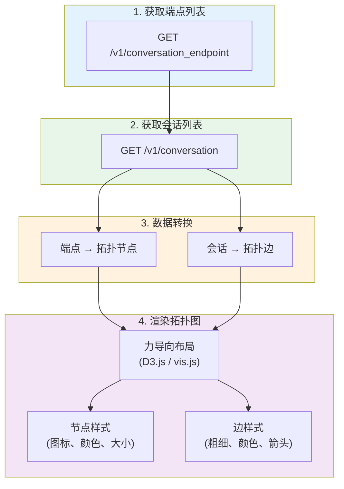
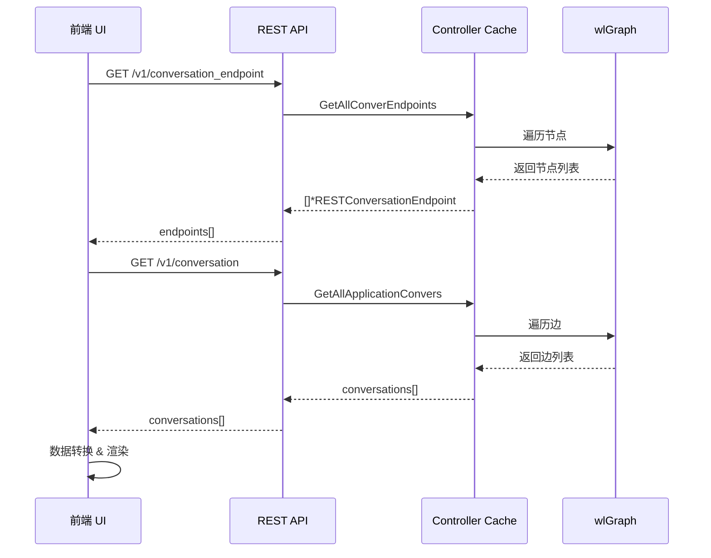

# 前端集成指南

## 一、概述

本文档描述如何在前端集成网络拓扑功能，包括数据获取、格式转换和渲染准备。

## 二、数据获取流程





## 三、API 调用示例

### 3.1 获取端点列表

```typescript
interface ConversationEndpoint {
  id: string;
  display_name: string;
  kind: 'container' | 'host' | 'external' | 'address';
  name?: string;
  domain?: string;
  service?: string;
  service_mesh?: boolean;
  policy_mode?: 'Discover' | 'Monitor' | 'Protect';
  state?: string;
  platform_role?: string;
}

interface EndpointResponse {
  endpoints: ConversationEndpoint[];
}

async function fetchEndpoints(): Promise<ConversationEndpoint[]> {
  const response = await fetch('/v1/conversation_endpoint', {
    headers: {
      'Authorization': `Bearer ${token}`,
      'Content-Type': 'application/json'
    }
  });

  const data: EndpointResponse = await response.json();
  return data.endpoints;
}
```

### 3.2 获取会话列表

```typescript
interface ConversationCompact {
  from: string;                    // 源端点 ID
  to: string;                      // 目标端点 ID
  bytes: number;                   // 传输字节数
  sessions: number;                // 会话数
  severity: string;                // 威胁等级
  policy_action: string;           // 策略动作
  protocols?: string[];            // 协议列表
  applications?: string[];         // 应用列表
  ports?: string[];                // 端口列表
}

interface ConversationsResponse {
  endpoints: ConversationEndpoint[];
  conversations: ConversationCompact[];
}

async function fetchConversations(): Promise<ConversationsResponse> {
  const response = await fetch('/v1/conversation', {
    headers: {
      'Authorization': `Bearer ${token}`,
      'Content-Type': 'application/json'
    }
  });

  return await response.json();
}
```

### 3.3 获取会话详情

```typescript
interface ConversationEntry {
  bytes: number;
  sessions: number;
  port: string;
  mapped_port: string;
  application: string;
  Server: string;
  threat_name: string;
  severity: string;
  policy_action: string;
  policy_id: number;
  last_seen_at: string;
  client_ip: string;
  server_ip: string;
  fqdn: string;
  xff: boolean;
  to_sidecar: boolean;
  nbe: boolean;
}

interface ConversationDetail {
  from: ConversationEndpoint;
  to: ConversationEndpoint;
  bytes: number;
  sessions: number;
  severity: string;
  policy_action: string;
  protocols: string[];
  applications: string[];
  ports: string[];
  entries: ConversationEntry[];
}

async function fetchConversationDetail(from: string, to: string): Promise<ConversationDetail> {
  const response = await fetch(`/v1/conversation/${encodeURIComponent(from)}/${encodeURIComponent(to)}`, {
    headers: {
      'Authorization': `Bearer ${token}`,
      'Content-Type': 'application/json'
    }
  });

  const data = await response.json();
  return data.conversation;
}
```

## 四、数据转换

### 4.1 转换为拓扑节点

```typescript
interface TopologyNode {
  id: string;
  label: string;
  type: 'container' | 'host' | 'external' | 'service' | 'group';
  icon: string;
  color: string;
  size: number;
  metadata: {
    domain?: string;
    service?: string;
    policyMode?: string;
    state?: string;
  };
}

function endpointToNode(endpoint: ConversationEndpoint): TopologyNode {
  const node: TopologyNode = {
    id: endpoint.id,
    label: endpoint.display_name || endpoint.name || endpoint.id,
    type: mapKindToType(endpoint.kind),
    icon: getIconForKind(endpoint.kind),
    color: getColorForPolicyMode(endpoint.policy_mode),
    size: 30,
    metadata: {
      domain: endpoint.domain,
      service: endpoint.service,
      policyMode: endpoint.policy_mode,
      state: endpoint.state
    }
  };

  return node;
}

function mapKindToType(kind: string): TopologyNode['type'] {
  switch (kind) {
    case 'container': return 'container';
    case 'host': return 'host';
    case 'external': return 'external';
    case 'address': return 'group';
    default: return 'container';
  }
}

function getIconForKind(kind: string): string {
  switch (kind) {
    case 'container': return 'container-icon';
    case 'host': return 'host-icon';
    case 'external': return 'external-icon';
    case 'address': return 'group-icon';
    default: return 'default-icon';
  }
}

function getColorForPolicyMode(mode?: string): string {
  switch (mode) {
    case 'Protect': return '#4CAF50';   // 绿色
    case 'Monitor': return '#FF9800';   // 橙色
    case 'Discover': return '#2196F3';  // 蓝色
    default: return '#9E9E9E';          // 灰色
  }
}
```

### 4.2 转换为拓扑边

```typescript
interface TopologyEdge {
  id: string;
  source: string;
  target: string;
  width: number;
  color: string;
  label: string;
  dashed: boolean;
  metadata: {
    bytes: number;
    sessions: number;
    severity: string;
    policyAction: string;
    protocols: string[];
    applications: string[];
    ports: string[];
  };
}

function conversationToEdge(conv: ConversationCompact): TopologyEdge {
  return {
    id: `${conv.from}-${conv.to}`,
    source: conv.from,
    target: conv.to,
    width: calculateEdgeWidth(conv.bytes),
    color: getColorForSeverity(conv.severity, conv.policy_action),
    label: formatBytes(conv.bytes),
    dashed: conv.policy_action === 'deny',
    metadata: {
      bytes: conv.bytes,
      sessions: conv.sessions,
      severity: conv.severity,
      policyAction: conv.policy_action,
      protocols: conv.protocols || [],
      applications: conv.applications || [],
      ports: conv.ports || []
    }
  };
}

function calculateEdgeWidth(bytes: number): number {
  // 根据流量大小计算边的宽度 (1-10)
  if (bytes < 1024) return 1;
  if (bytes < 1024 * 1024) return 3;
  if (bytes < 1024 * 1024 * 1024) return 6;
  return 10;
}

function getColorForSeverity(severity: string, action: string): string {
  if (action === 'deny') return '#F44336';      // 红色 - 拒绝
  if (action === 'violate') return '#FF5722';   // 深橙 - 违规

  switch (severity) {
    case 'critical': return '#B71C1C';
    case 'high': return '#F44336';
    case 'medium': return '#FF9800';
    case 'low': return '#FFC107';
    default: return '#4CAF50';                  // 绿色 - 正常
  }
}

function formatBytes(bytes: number): string {
  if (bytes < 1024) return `${bytes} B`;
  if (bytes < 1024 * 1024) return `${(bytes / 1024).toFixed(1)} KB`;
  if (bytes < 1024 * 1024 * 1024) return `${(bytes / 1024 / 1024).toFixed(1)} MB`;
  return `${(bytes / 1024 / 1024 / 1024).toFixed(1)} GB`;
}
```

## 五、拓扑数据聚合

### 5.1 按服务分组

```typescript
interface ServiceGroup {
  id: string;
  name: string;
  domain: string;
  nodes: TopologyNode[];
  collapsed: boolean;
}

function groupNodesByService(nodes: TopologyNode[]): ServiceGroup[] {
  const groups = new Map<string, ServiceGroup>();

  for (const node of nodes) {
    const service = node.metadata.service || 'Unknown';
    const domain = node.metadata.domain || 'default';
    const groupId = `${domain}/${service}`;

    if (!groups.has(groupId)) {
      groups.set(groupId, {
        id: groupId,
        name: service,
        domain: domain,
        nodes: [],
        collapsed: false
      });
    }

    groups.get(groupId)!.nodes.push(node);
  }

  return Array.from(groups.values());
}
```

### 5.2 聚合服务间的边

```typescript
interface AggregatedEdge {
  source: string;         // 源服务组 ID
  target: string;         // 目标服务组 ID
  totalBytes: number;
  totalSessions: number;
  maxSeverity: string;
  edges: TopologyEdge[];  // 原始边列表
}

function aggregateEdgesByService(
  edges: TopologyEdge[],
  nodeToService: Map<string, string>
): AggregatedEdge[] {
  const aggregated = new Map<string, AggregatedEdge>();

  for (const edge of edges) {
    const sourceService = nodeToService.get(edge.source) || edge.source;
    const targetService = nodeToService.get(edge.target) || edge.target;
    const key = `${sourceService}->${targetService}`;

    if (!aggregated.has(key)) {
      aggregated.set(key, {
        source: sourceService,
        target: targetService,
        totalBytes: 0,
        totalSessions: 0,
        maxSeverity: '',
        edges: []
      });
    }

    const agg = aggregated.get(key)!;
    agg.totalBytes += edge.metadata.bytes;
    agg.totalSessions += edge.metadata.sessions;
    agg.maxSeverity = getHigherSeverity(agg.maxSeverity, edge.metadata.severity);
    agg.edges.push(edge);
  }

  return Array.from(aggregated.values());
}

function getHigherSeverity(a: string, b: string): string {
  const order = ['', 'low', 'medium', 'high', 'critical'];
  return order.indexOf(a) > order.indexOf(b) ? a : b;
}
```

## 六、渲染集成

### 6.1 D3.js 力导向布局示例

```typescript
import * as d3 from 'd3';

interface D3Node extends TopologyNode {
  x?: number;
  y?: number;
  fx?: number | null;
  fy?: number | null;
}

interface D3Edge extends TopologyEdge {
  source: D3Node | string;
  target: D3Node | string;
}

class TopologyRenderer {
  private svg: d3.Selection<SVGSVGElement, unknown, null, undefined>;
  private simulation: d3.Simulation<D3Node, D3Edge>;
  private nodes: D3Node[] = [];
  private edges: D3Edge[] = [];

  constructor(container: HTMLElement, width: number, height: number) {
    this.svg = d3.select(container)
      .append('svg')
      .attr('width', width)
      .attr('height', height);

    // 初始化力导向模拟
    this.simulation = d3.forceSimulation<D3Node>()
      .force('link', d3.forceLink<D3Node, D3Edge>().id(d => d.id))
      .force('charge', d3.forceManyBody().strength(-300))
      .force('center', d3.forceCenter(width / 2, height / 2))
      .force('collision', d3.forceCollide().radius(50));
  }

  render(nodes: TopologyNode[], edges: TopologyEdge[]) {
    this.nodes = nodes as D3Node[];
    this.edges = edges as D3Edge[];

    // 绘制边
    const linkGroup = this.svg.selectAll('.link')
      .data(this.edges)
      .enter()
      .append('line')
      .attr('class', 'link')
      .attr('stroke', d => d.color)
      .attr('stroke-width', d => d.width)
      .attr('stroke-dasharray', d => d.dashed ? '5,5' : 'none');

    // 绘制节点
    const nodeGroup = this.svg.selectAll('.node')
      .data(this.nodes)
      .enter()
      .append('g')
      .attr('class', 'node')
      .call(this.drag());

    nodeGroup.append('circle')
      .attr('r', d => d.size / 2)
      .attr('fill', d => d.color);

    nodeGroup.append('text')
      .attr('dy', d => d.size / 2 + 15)
      .attr('text-anchor', 'middle')
      .text(d => d.label);

    // 启动模拟
    this.simulation
      .nodes(this.nodes)
      .on('tick', () => this.ticked(linkGroup, nodeGroup));

    (this.simulation.force('link') as d3.ForceLink<D3Node, D3Edge>)
      .links(this.edges);
  }

  private ticked(
    linkGroup: d3.Selection<SVGLineElement, D3Edge, SVGSVGElement, unknown>,
    nodeGroup: d3.Selection<SVGGElement, D3Node, SVGSVGElement, unknown>
  ) {
    linkGroup
      .attr('x1', d => (d.source as D3Node).x!)
      .attr('y1', d => (d.source as D3Node).y!)
      .attr('x2', d => (d.target as D3Node).x!)
      .attr('y2', d => (d.target as D3Node).y!);

    nodeGroup
      .attr('transform', d => `translate(${d.x},${d.y})`);
  }

  private drag() {
    return d3.drag<SVGGElement, D3Node>()
      .on('start', (event, d) => {
        if (!event.active) this.simulation.alphaTarget(0.3).restart();
        d.fx = d.x;
        d.fy = d.y;
      })
      .on('drag', (event, d) => {
        d.fx = event.x;
        d.fy = event.y;
      })
      .on('end', (event, d) => {
        if (!event.active) this.simulation.alphaTarget(0);
        d.fx = null;
        d.fy = null;
      });
  }
}
```

### 6.2 Vue.js 组件示例

```vue
<template>
  <div class="topology-container">
    <div class="toolbar">
      <select v-model="viewMode">
        <option value="pod">Pod 视图</option>
        <option value="service">服务视图</option>
      </select>
      <input v-model="searchTerm" placeholder="搜索节点..." />
      <button @click="refresh">刷新</button>
    </div>

    <div ref="graphContainer" class="graph-container"></div>

    <div v-if="selectedNode" class="detail-panel">
      <h3>{{ selectedNode.label }}</h3>
      <p>类型: {{ selectedNode.type }}</p>
      <p>策略模式: {{ selectedNode.metadata.policyMode }}</p>
      <p>服务: {{ selectedNode.metadata.service }}</p>
    </div>

    <div v-if="selectedEdge" class="detail-panel">
      <h3>连接详情</h3>
      <p>流量: {{ formatBytes(selectedEdge.metadata.bytes) }}</p>
      <p>会话数: {{ selectedEdge.metadata.sessions }}</p>
      <p>协议: {{ selectedEdge.metadata.protocols.join(', ') }}</p>
      <p>应用: {{ selectedEdge.metadata.applications.join(', ') }}</p>
    </div>
  </div>
</template>

<script lang="ts">
import { defineComponent, ref, onMounted, watch } from 'vue';
import { TopologyRenderer } from './TopologyRenderer';
import { fetchConversations } from './api';
import { endpointToNode, conversationToEdge } from './converters';

export default defineComponent({
  name: 'NetworkTopology',

  setup() {
    const graphContainer = ref<HTMLElement | null>(null);
    const viewMode = ref('pod');
    const searchTerm = ref('');
    const selectedNode = ref<TopologyNode | null>(null);
    const selectedEdge = ref<TopologyEdge | null>(null);

    let renderer: TopologyRenderer | null = null;

    const loadData = async () => {
      const data = await fetchConversations();

      const nodes = data.endpoints.map(endpointToNode);
      const edges = data.conversations.map(conversationToEdge);

      // 过滤
      const filteredNodes = searchTerm.value
        ? nodes.filter(n => n.label.includes(searchTerm.value))
        : nodes;

      const nodeIds = new Set(filteredNodes.map(n => n.id));
      const filteredEdges = edges.filter(
        e => nodeIds.has(e.source) && nodeIds.has(e.target)
      );

      renderer?.render(filteredNodes, filteredEdges);
    };

    const refresh = () => loadData();

    onMounted(() => {
      if (graphContainer.value) {
        renderer = new TopologyRenderer(
          graphContainer.value,
          graphContainer.value.clientWidth,
          graphContainer.value.clientHeight
        );
        loadData();
      }
    });

    watch([viewMode, searchTerm], () => loadData());

    return {
      graphContainer,
      viewMode,
      searchTerm,
      selectedNode,
      selectedEdge,
      refresh,
      formatBytes
    };
  }
});
</script>

<style scoped>
.topology-container {
  display: flex;
  flex-direction: column;
  height: 100%;
}

.toolbar {
  padding: 10px;
  background: #f5f5f5;
  border-bottom: 1px solid #ddd;
}

.graph-container {
  flex: 1;
  overflow: hidden;
}

.detail-panel {
  position: absolute;
  right: 20px;
  top: 80px;
  width: 300px;
  background: white;
  border: 1px solid #ddd;
  border-radius: 4px;
  padding: 15px;
  box-shadow: 0 2px 8px rgba(0,0,0,0.1);
}
</style>
```

## 七、实时更新

### 7.1 轮询机制

```typescript
class TopologyPoller {
  private intervalId: number | null = null;
  private pollInterval = 5000; // 5 秒

  constructor(
    private onUpdate: (nodes: TopologyNode[], edges: TopologyEdge[]) => void
  ) {}

  start() {
    this.poll();
    this.intervalId = window.setInterval(() => this.poll(), this.pollInterval);
  }

  stop() {
    if (this.intervalId) {
      clearInterval(this.intervalId);
      this.intervalId = null;
    }
  }

  private async poll() {
    try {
      const data = await fetchConversations();
      const nodes = data.endpoints.map(endpointToNode);
      const edges = data.conversations.map(conversationToEdge);
      this.onUpdate(nodes, edges);
    } catch (error) {
      console.error('Failed to poll topology:', error);
    }
  }

  setInterval(interval: number) {
    this.pollInterval = interval;
    if (this.intervalId) {
      this.stop();
      this.start();
    }
  }
}
```

### 7.2 增量更新

```typescript
class IncrementalUpdater {
  private previousNodes = new Map<string, TopologyNode>();
  private previousEdges = new Map<string, TopologyEdge>();

  update(nodes: TopologyNode[], edges: TopologyEdge[]): {
    addedNodes: TopologyNode[];
    removedNodes: string[];
    updatedNodes: TopologyNode[];
    addedEdges: TopologyEdge[];
    removedEdges: string[];
    updatedEdges: TopologyEdge[];
  } {
    const currentNodes = new Map(nodes.map(n => [n.id, n]));
    const currentEdges = new Map(edges.map(e => [e.id, e]));

    // 计算节点差异
    const addedNodes = nodes.filter(n => !this.previousNodes.has(n.id));
    const removedNodes = Array.from(this.previousNodes.keys())
      .filter(id => !currentNodes.has(id));
    const updatedNodes = nodes.filter(n => {
      const prev = this.previousNodes.get(n.id);
      return prev && JSON.stringify(prev) !== JSON.stringify(n);
    });

    // 计算边差异
    const addedEdges = edges.filter(e => !this.previousEdges.has(e.id));
    const removedEdges = Array.from(this.previousEdges.keys())
      .filter(id => !currentEdges.has(id));
    const updatedEdges = edges.filter(e => {
      const prev = this.previousEdges.get(e.id);
      return prev && JSON.stringify(prev) !== JSON.stringify(e);
    });

    // 保存当前状态
    this.previousNodes = currentNodes;
    this.previousEdges = currentEdges;

    return {
      addedNodes,
      removedNodes,
      updatedNodes,
      addedEdges,
      removedEdges,
      updatedEdges
    };
  }
}
```

## 八、交互功能

### 8.1 节点点击

```typescript
function handleNodeClick(node: TopologyNode) {
  // 显示节点详情
  showNodeDetail(node);

  // 高亮相关边
  highlightConnectedEdges(node.id);
}

function highlightConnectedEdges(nodeId: string) {
  edges.forEach(edge => {
    const isConnected = edge.source === nodeId || edge.target === nodeId;
    edge.highlighted = isConnected;
  });
}
```

### 8.2 边点击

```typescript
async function handleEdgeClick(edge: TopologyEdge) {
  // 获取详细会话信息
  const detail = await fetchConversationDetail(edge.source, edge.target);

  // 显示详情面板
  showEdgeDetail(detail);
}
```

### 8.3 右键菜单

```typescript
interface ContextMenuAction {
  label: string;
  icon: string;
  action: () => void;
}

function getNodeContextMenu(node: TopologyNode): ContextMenuAction[] {
  return [
    {
      label: '查看容器日志',
      icon: 'log-icon',
      action: () => viewContainerLogs(node.id)
    },
    {
      label: '查看安全事件',
      icon: 'security-icon',
      action: () => viewSecurityEvents(node.id)
    },
    {
      label: '编辑策略',
      icon: 'policy-icon',
      action: () => editPolicy(node.id)
    },
    {
      label: '设置别名',
      icon: 'edit-icon',
      action: () => setAlias(node.id)
    }
  ];
}

function getEdgeContextMenu(edge: TopologyEdge): ContextMenuAction[] {
  return [
    {
      label: '查看会话详情',
      icon: 'detail-icon',
      action: () => viewSessionDetail(edge)
    },
    {
      label: '创建规则',
      icon: 'rule-icon',
      action: () => createRule(edge.source, edge.target)
    },
    {
      label: '删除会话',
      icon: 'delete-icon',
      action: () => deleteConversation(edge.source, edge.target)
    }
  ];
}
```

## 九、过滤和搜索

### 9.1 多维度过滤

```typescript
interface TopologyFilter {
  domain?: string;
  service?: string;
  policyMode?: string;
  severity?: string;
  policyAction?: string;
  searchTerm?: string;
}

function filterTopology(
  nodes: TopologyNode[],
  edges: TopologyEdge[],
  filter: TopologyFilter
): { nodes: TopologyNode[]; edges: TopologyEdge[] } {

  // 过滤节点
  let filteredNodes = nodes;

  if (filter.domain) {
    filteredNodes = filteredNodes.filter(
      n => n.metadata.domain === filter.domain
    );
  }

  if (filter.service) {
    filteredNodes = filteredNodes.filter(
      n => n.metadata.service === filter.service
    );
  }

  if (filter.policyMode) {
    filteredNodes = filteredNodes.filter(
      n => n.metadata.policyMode === filter.policyMode
    );
  }

  if (filter.searchTerm) {
    const term = filter.searchTerm.toLowerCase();
    filteredNodes = filteredNodes.filter(
      n => n.label.toLowerCase().includes(term) ||
           n.id.toLowerCase().includes(term)
    );
  }

  // 过滤边
  const nodeIds = new Set(filteredNodes.map(n => n.id));
  let filteredEdges = edges.filter(
    e => nodeIds.has(e.source) && nodeIds.has(e.target)
  );

  if (filter.severity) {
    filteredEdges = filteredEdges.filter(
      e => e.metadata.severity === filter.severity
    );
  }

  if (filter.policyAction) {
    filteredEdges = filteredEdges.filter(
      e => e.metadata.policyAction === filter.policyAction
    );
  }

  return { nodes: filteredNodes, edges: filteredEdges };
}
```

## 十、性能优化

### 10.1 虚拟化大型拓扑

```typescript
class TopologyVirtualizer {
  private viewport: { x: number; y: number; width: number; height: number };
  private allNodes: TopologyNode[];
  private allEdges: TopologyEdge[];

  getVisibleElements(): { nodes: TopologyNode[]; edges: TopologyEdge[] } {
    // 只返回视口内的元素
    const visibleNodes = this.allNodes.filter(n =>
      this.isInViewport(n.x!, n.y!)
    );

    const visibleNodeIds = new Set(visibleNodes.map(n => n.id));
    const visibleEdges = this.allEdges.filter(e =>
      visibleNodeIds.has(e.source) || visibleNodeIds.has(e.target)
    );

    return { nodes: visibleNodes, edges: visibleEdges };
  }

  private isInViewport(x: number, y: number): boolean {
    return x >= this.viewport.x &&
           x <= this.viewport.x + this.viewport.width &&
           y >= this.viewport.y &&
           y <= this.viewport.y + this.viewport.height;
  }
}
```

### 10.2 节点聚类

```typescript
function clusterNodes(
  nodes: TopologyNode[],
  maxNodes: number
): TopologyNode[] {
  if (nodes.length <= maxNodes) {
    return nodes;
  }

  // 按服务分组
  const groups = groupNodesByService(nodes);

  // 将大组折叠为单个节点
  const result: TopologyNode[] = [];

  for (const group of groups) {
    if (group.nodes.length === 1) {
      result.push(group.nodes[0]);
    } else {
      // 创建聚合节点
      result.push({
        id: group.id,
        label: `${group.name} (${group.nodes.length})`,
        type: 'service',
        icon: 'cluster-icon',
        color: '#9E9E9E',
        size: 40 + Math.log(group.nodes.length) * 5,
        metadata: {
          domain: group.domain,
          service: group.name
        }
      });
    }
  }

  return result;
}
```

## 十一、关键要点

1. **API 调用**: 使用 `/v1/conversation_endpoint` 和 `/v1/conversation` 获取数据
2. **数据转换**: 将 API 响应转换为前端可渲染的节点和边结构
3. **视图模式**: 支持 Pod 视图和服务视图切换
4. **实时更新**: 通过轮询实现拓扑实时刷新
5. **交互功能**: 支持点击、拖拽、右键菜单等交互
6. **性能优化**: 大型拓扑需要虚拟化和聚类处理

