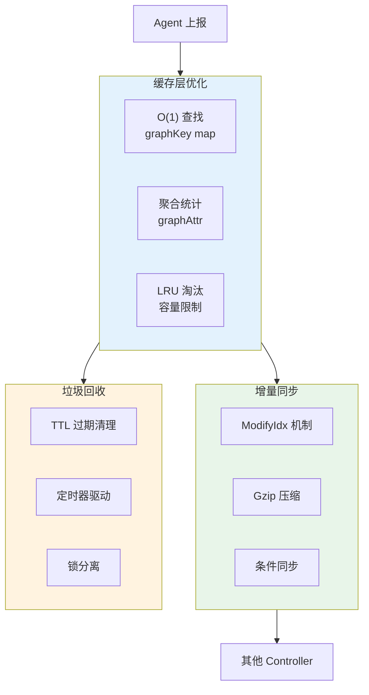
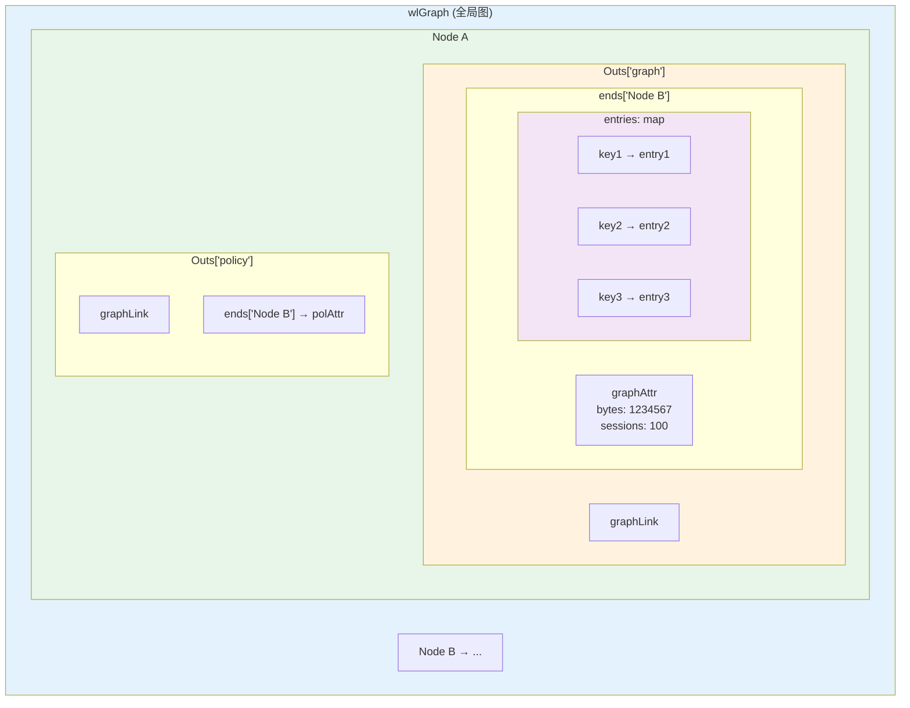
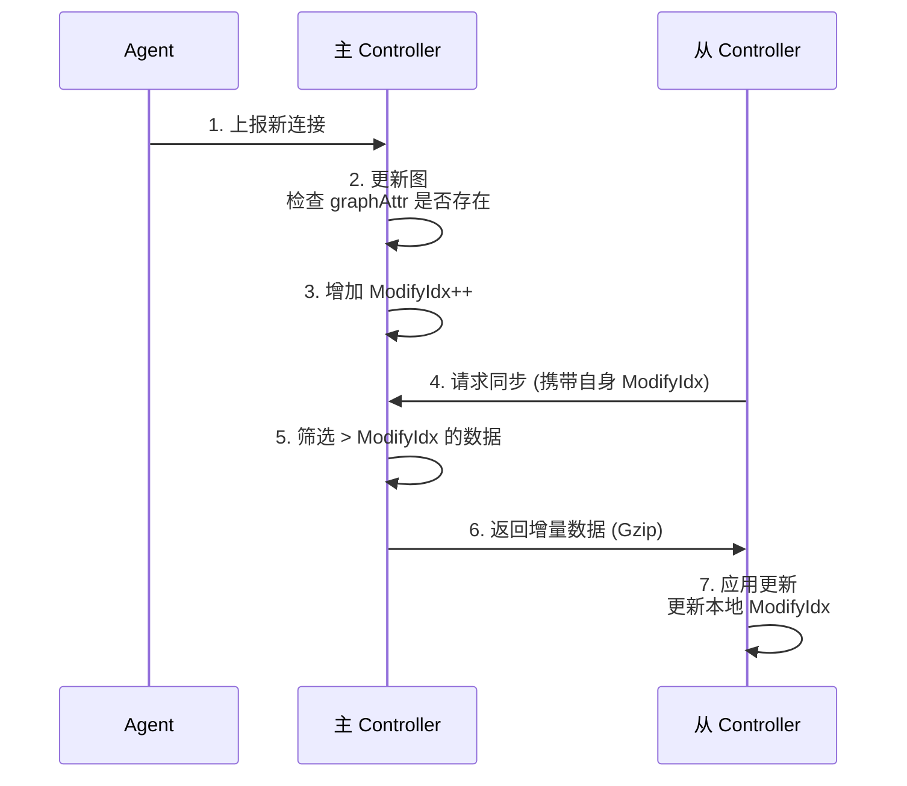
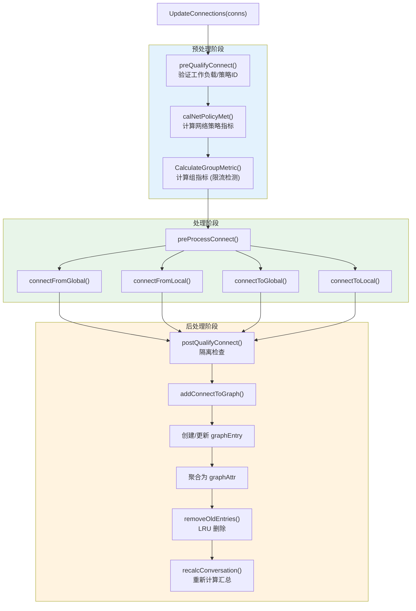

# 性能优化机制

## 一、概述

本文档详细介绍网络拓扑系统的性能优化机制，包括缓存结构、增量更新、TTL/淘汰策略和大规模集群优化。



## 二、关键源文件

| 文件 | 路径 | 功能 |
|------|------|------|
| 连接管理 | `controller/cache/connect.go` | 核心缓存结构 |
| 学习模块 | `controller/cache/learn.go` | LRU 淘汰机制 |
| 同步模块 | `controller/cache/sync.go` | 增量同步框架 |
| 缓存管理 | `controller/cache/cache.go` | 后台任务和常量 |

## 三、缓存数据结构

### 3.1 核心结构关系



### 3.2 graphKey - 快速查找键

**源码位置**: `controller/cache/connect.go:43-49`

```go
type graphKey struct {
    port        uint16   // 服务端口
    ipproto     uint8    // IP 协议 (TCP=6, UDP=17)
    application uint32   // 应用 ID
    cip         uint32   // 客户端 IP (hash)
    sip         uint32   // 服务端 IP (hash)
}
```

**设计要点**:
- 固定大小的结构体，可作为 map 键
- IP 使用 hash 值减少内存占用
- 支持 O(1) 查找和更新

### 3.3 graphEntry - 细粒度连接数据

**源码位置**: `controller/cache/connect.go:51-68`

```go
type graphEntry struct {
    bytes        uint64   // 传输字节数
    sessions     uint32   // 会话数
    server       uint32   // 服务器应用标识
    threatID     uint32   // 威胁 ID
    dlpID        uint32   // DLP 威胁 ID
    wafID        uint32   // WAF 威胁 ID
    mappedPort   uint16   // 映射端口
    severity     uint8    // 严重级别 (0-4)
    dlpSeverity  uint8    // DLP 严重级别
    wafSeverity  uint8    // WAF 严重级别
    policyAction uint8    // 策略动作
    policyID     uint32   // 策略规则 ID
    last         uint32   // 最后见时间 (Unix timestamp)
    xff          uint8    // X-Forwarded-For 标志
    toSidecar    uint8    // 到边车标志
    fqdn         string   // FQDN (仅出口方向)
    nbe          uint8    // 未发送到边车标志
}
```

**内存优化**:
- 使用 uint8/uint16/uint32 而非 int，减少内存占用
- 布尔值用 uint8 表示，节省对齐开销
- fqdn 仅在出口方向存储

### 3.4 graphAttr - 聚合统计

**源码位置**: `controller/cache/connect.go:79-85`

```go
type graphAttr struct {
    bytes        uint64                   // 总字节数 (聚合)
    sessions     uint32                   // 总会话数 (聚合)
    severity     uint8                    // 最高严重级别
    policyAction uint8                    // 聚合策略动作
    entries      map[graphKey]*graphEntry // 按 5 元组索引的详细条目
}
```

**聚合逻辑**:
```go
func recalcConversation(attr *graphAttr) {
    var totalBytes uint64
    var totalSessions uint32
    var maxSeverity uint8
    var maxAction uint8

    for _, entry := range attr.entries {
        totalBytes += entry.bytes
        totalSessions += entry.sessions
        if entry.severity > maxSeverity {
            maxSeverity = entry.severity
        }
        if entry.policyAction > maxAction {
            maxAction = entry.policyAction
        }
    }

    attr.bytes = totalBytes
    attr.sessions = totalSessions
    attr.severity = maxSeverity
    attr.policyAction = maxAction
}
```

## 四、增量更新机制

### 4.1 ModifyIdx 机制

**源码位置**: `controller/cache/sync.go:18-50`

```go
// 同步分类
const (
    syncCatgEvent    = iota  // 事件
    syncCatgThreat           // 威胁
    syncCatgGraph            // 拓扑图
    syncCatgIncident         // 事件
    syncCatgAudit            // 审计
    syncCatgActivity         // 活动
    syncCatgMax
)

// 每个分类的修改索引
type syncCatgAux struct {
    modifyIdx uint64
    lastSync  time.Time
}

var syncCatgAuxArray [syncCatgMax]*syncCatgAux

// 检查是否需要同步
func checkModifyIdx(catg int, idx uint64) bool {
    return idx > syncCatgAuxArray[catg].modifyIdx
}

// 更新修改索引
func updateModifyIdx(catg int, idx uint64) {
    if idx > syncCatgAuxArray[catg].modifyIdx {
        syncCatgAuxArray[catg].modifyIdx = idx
        syncCatgAuxArray[catg].lastSync = time.Now()
    }
}
```

### 4.2 增量同步数据结构

**源码位置**: `controller/cache/learn.go:1317-1380`

```go
// 图同步数据包
type graphSyncData struct {
    Nodes          []*graphSyncNodeData     // 新增/更新的节点
    Links          []*graphSyncLinkData     // 连接数据
    Vios           []*api.Violation         // 违规数据
    LearnedRules   []*graphSyncLearnedRule  // 学习到的规则
    MaxLearnRuleID uint32                   // 最大规则 ID
}

// 单条连接条目
type GraphSyncEntry struct {
    Ipproto      uint8
    Port         uint16
    Application  uint32
    CIP, SIP     uint32
    MappedPort   uint16
    ThreatID     uint32
    DlpID, WafID uint32
    Severity     uint8
    PolicyAction uint8
    PolicyID     uint32
    Bytes        uint64
    Sessions     uint32
    Last         uint32
    Xff, Nbe     uint8
    FQDN         string
}
```

### 4.3 Gzip 压缩传输

```go
// 同步消息结构
type syncDataMsg struct {
    CatgName  string `json:"name"`        // 分类名称
    ErrorCode int    `json:"error_code"`
    ModifyIdx uint64 `json:"modifyIdx"`   // 修改索引
    Data      []byte `json:"data"`        // Gzip 压缩数据
}

// 压缩数据
func compressData(data interface{}) ([]byte, error) {
    jsonData, err := json.Marshal(data)
    if err != nil {
        return nil, err
    }

    var buf bytes.Buffer
    gz := gzip.NewWriter(&buf)
    if _, err := gz.Write(jsonData); err != nil {
        return nil, err
    }
    gz.Close()

    return buf.Bytes(), nil
}

// 解压数据
func decompressData(compressed []byte, target interface{}) error {
    reader, err := gzip.NewReader(bytes.NewReader(compressed))
    if err != nil {
        return err
    }
    defer reader.Close()

    return json.NewDecoder(reader).Decode(target)
}
```

### 4.4 增量更新流程



## 五、TTL/淘汰策略

### 5.1 关键常量

**源码位置**: `controller/cache/cache.go:132-140`

```go
const (
    workloadEphemeralPeriod = time.Duration(time.Minute * 2)   // 检查周期
    workloadEphemeralLife   = time.Duration(time.Minute * 30)  // 保留生命周期
    pruneKVPeriod           = time.Duration(time.Minute * 30)  // KV 清理周期
    pruneGroupPeriod        = time.Duration(time.Minute * 1)   // 组清理周期
)
```

### 5.2 工作负载过期清理

```go
// 设备 IP 映射
var ipDevMap map[string]*ipDevice

type ipDevice struct {
    id    string
    stop  time.Time  // 停止时间 (Zero = 运行中)
}

// 检查设备 IP 是否有效
func isDeviceIP(ip net.IP) bool {
    ipStr := ip.String()
    if dev, ok := ipDevMap[ipStr]; ok {
        if dev.stop.IsZero() {
            return true  // 运行中
        }
        // 检查是否在生命周期内
        if time.Since(dev.stop) < workloadEphemeralLife {
            return true
        } else {
            // 过期清理
            delete(ipDevMap, ipStr)
            return false
        }
    }
    return false
}

// 定时检查过期工作负载
func timeoutEphemeralWorkload() bool {
    var needRefresh bool

    for ip, dev := range ipDevMap {
        if !dev.stop.IsZero() && time.Since(dev.stop) > workloadEphemeralLife {
            delete(ipDevMap, ip)
            needRefresh = true
        }
    }

    return needRefresh
}
```

### 5.3 LRU 淘汰机制

**源码位置**: `controller/cache/learn.go:89-125`

```go
// 删除最老的条目
func removeOldEntries(a *graphAttr, max, count int) bool {
    total := len(a.entries)
    if total <= max {
        return false  // 未超过限制
    }

    // 构建条目列表并按最后见时间排序
    entries := make([]*entryWithKey, 0, len(a.entries))
    for key, entry := range a.entries {
        entries = append(entries, &entryWithKey{
            key:   key,
            entry: entry,
        })
    }

    // 按最后见时间升序排序 (最老的在前)
    sort.Slice(entries, func(i, j int) bool {
        return entries[i].entry.last < entries[j].entry.last
    })

    // 删除最老的 count 条
    removeCnt := 0
    for _, e := range entries {
        delete(a.entries, e.key)
        removeCnt++
        if removeCnt >= count {
            break
        }
    }

    // 重新计算聚合统计
    recalcConversation(a)

    return true
}
```

### 5.4 垃圾回收定时器

```go
// 后台定时任务
func startWorkerThread() {
    // 创建定时器
    ephemeralTicker := time.NewTicker(workloadEphemeralPeriod)
    pruneKvTicker := time.NewTicker(pruneKVPeriod)
    pruneGroupTicker := time.NewTicker(pruneGroupPeriod)

    go func() {
        for {
            select {
            case <-ephemeralTicker.C:
                // 清理临时工作负载
                if timeoutEphemeralWorkload() {
                    refreshInternalIPNet()
                }

            case <-pruneKvTicker.C:
                // 清理孤立的 KV 条目
                pruneWorkloadKV(wlSuspected)

            case <-pruneGroupTicker.C:
                // 清理空的命名空间组
                pruneEmptyGroups()
            }
        }
    }()
}
```

## 六、大规模集群优化

### 6.1 采样限制

**源码位置**: `controller/cache/connect.go:506-550`

```go
// 工作负载指标采样限制
const CalWlMetMax int = 32

// 计算组指标 (带采样)
func calGrpMet(grpName, epWL string, cache *workloadCache,
               grpCache *groupCache, conn *share.CLUSConnection) {

    memberCount := len(grpCache.members)
    exceedMax := false

    // 检查是否超过采样限制
    if len(grpMet.WlMetric) >= CalWlMetMax && memberCount > CalWlMetMax {
        exceedMax = true
    }

    if !exceedMax {
        // 正常添加到指标 map
        wlMet := &share.CLUSWlMetric{
            SessionIn:  conn.Sessions,
            BytesIn:    conn.Bytes,
            // ...
        }
        grpMet.WlMetric[epWL] = wlMet
    }

    if exceedMax {
        // 使用平均值扩展到全组
        avgSessIn := float32(grpMet.GroupSessCurIn) / float32(CalWlMetMax)
        grpMet.GroupSessCurIn = uint32(avgSessIn * float32(memberCount))

        avgBytesIn := float32(grpMet.GroupBytesCurIn) / float32(CalWlMetMax)
        grpMet.GroupBytesCurIn = uint64(avgBytesIn * float64(memberCount))
    }
}
```

### 6.2 锁分离

```go
// 图数据锁
var graphMutex sync.RWMutex

// 缓存数据锁
var cacheMutex sync.RWMutex

// 锁序规则: graphMutex 内可以使用 cacheMutex，反之不行
// 这避免了死锁并提高了并发性

// 更新连接 (需要 graphMutex)
func UpdateConnections(conns []*share.CLUSConnection) {
    graphMutex.Lock()
    defer graphMutex.Unlock()

    for _, conn := range conns {
        // 可以在此获取 cacheMutex
        cacheMutex.RLock()
        wl := workloadCache[conn.ClientWL]
        cacheMutex.RUnlock()

        addConnectToGraph(conn, wl)
    }
}

// 查询缓存 (只需要 cacheMutex)
func GetWorkload(id string) *api.Workload {
    cacheMutex.RLock()
    defer cacheMutex.RUnlock()

    return workloadCache[id]
}
```

### 6.3 后台定时任务

**源码位置**: `controller/cache/cache.go:1664-1750`

```go
// 定时器配置
const (
    groupMetricCheckPeriod  = time.Duration(time.Minute * 1)   // 组指标检查
    policyMetricCheckPeriod = time.Duration(time.Second * 20)  // 策略指标更新
    syncCheckPeriod         = time.Duration(time.Second * 10)  // 同步检查
)

func startBackgroundTasks() {
    groupMetricTicker := time.NewTicker(groupMetricCheckPeriod)
    policyMetricTicker := time.NewTicker(policyMetricCheckPeriod)
    syncTicker := time.NewTicker(syncCheckPeriod)

    go func() {
        for {
            select {
            case <-groupMetricTicker.C:
                // 检查组指标违规 (限流检测)
                checkGroupMetricViolation()

            case <-policyMetricTicker.C:
                // 更新策略匹配指标
                updatePolicyMetrics()

            case <-syncTicker.C:
                // 检查并执行增量同步
                checkAndSync()
            }
        }
    }()
}
```

### 6.4 连接处理流水线



## 七、性能监控指标

### 7.1 关键常量汇总

| 常量 | 值 | 用途 |
|------|-----|------|
| CalWlMetMax | 32 | 大集群采样限制 |
| workloadEphemeralPeriod | 2分钟 | 清理检查周期 |
| workloadEphemeralLife | 30分钟 | 临时对象保留期 |
| pruneKVPeriod | 30分钟 | KV 垃圾收集周期 |
| pruneGroupPeriod | 1分钟 | 组清理周期 |
| groupMetricCheckPeriod | 1分钟 | 组指标检查周期 |
| policyMetricCheckPeriod | 20秒 | 策略指标更新周期 |
| syncCheckPeriod | 10秒 | 同步检查周期 |

### 7.2 内存估算

```go
// 单个 graphEntry 大小估算
type graphEntry struct {
    bytes        uint64   // 8 bytes
    sessions     uint32   // 4 bytes
    server       uint32   // 4 bytes
    threatID     uint32   // 4 bytes
    dlpID        uint32   // 4 bytes
    wafID        uint32   // 4 bytes
    mappedPort   uint16   // 2 bytes
    severity     uint8    // 1 byte
    dlpSeverity  uint8    // 1 byte
    wafSeverity  uint8    // 1 byte
    policyAction uint8    // 1 byte
    policyID     uint32   // 4 bytes
    last         uint32   // 4 bytes
    xff          uint8    // 1 byte
    toSidecar    uint8    // 1 byte
    fqdn         string   // 16 bytes (header) + len(fqdn)
    nbe          uint8    // 1 byte
}
// 总计: ~60 bytes + fqdn 长度 (通常 <100 bytes)

// 单个 graphKey 大小
type graphKey struct {
    port        uint16   // 2 bytes
    ipproto     uint8    // 1 byte
    application uint32   // 4 bytes
    cip         uint32   // 4 bytes
    sip         uint32   // 4 bytes
}
// 总计: 15 bytes (对齐后 ~16 bytes)
```

## 八、简化实现示例

```go
package cache

import (
    "sync"
    "time"
)

// 性能优化的连接缓存
type ConnCache struct {
    mu       sync.RWMutex
    entries  map[string]*ConnEntry
    maxSize  int
    ttl      time.Duration
}

type ConnEntry struct {
    Bytes     uint64
    Sessions  uint32
    LastSeen  time.Time
}

func NewConnCache(maxSize int, ttl time.Duration) *ConnCache {
    c := &ConnCache{
        entries: make(map[string]*ConnEntry),
        maxSize: maxSize,
        ttl:     ttl,
    }
    go c.startCleanup()
    return c
}

// 更新连接 (O(1) 平均)
func (c *ConnCache) Update(key string, bytes uint64, sessions uint32) {
    c.mu.Lock()
    defer c.mu.Unlock()

    if entry, ok := c.entries[key]; ok {
        entry.Bytes += bytes
        entry.Sessions += sessions
        entry.LastSeen = time.Now()
    } else {
        // 检查容量
        if len(c.entries) >= c.maxSize {
            c.evictOldest()
        }
        c.entries[key] = &ConnEntry{
            Bytes:    bytes,
            Sessions: sessions,
            LastSeen: time.Now(),
        }
    }
}

// LRU 淘汰
func (c *ConnCache) evictOldest() {
    var oldestKey string
    var oldestTime time.Time

    for key, entry := range c.entries {
        if oldestKey == "" || entry.LastSeen.Before(oldestTime) {
            oldestKey = key
            oldestTime = entry.LastSeen
        }
    }

    if oldestKey != "" {
        delete(c.entries, oldestKey)
    }
}

// TTL 清理
func (c *ConnCache) startCleanup() {
    ticker := time.NewTicker(time.Minute)
    for range ticker.C {
        c.cleanup()
    }
}

func (c *ConnCache) cleanup() {
    c.mu.Lock()
    defer c.mu.Unlock()

    now := time.Now()
    for key, entry := range c.entries {
        if now.Sub(entry.LastSeen) > c.ttl {
            delete(c.entries, key)
        }
    }
}

// 获取所有条目 (读锁)
func (c *ConnCache) GetAll() map[string]*ConnEntry {
    c.mu.RLock()
    defer c.mu.RUnlock()

    result := make(map[string]*ConnEntry, len(c.entries))
    for k, v := range c.entries {
        result[k] = &ConnEntry{
            Bytes:    v.Bytes,
            Sessions: v.Sessions,
            LastSeen: v.LastSeen,
        }
    }
    return result
}
```

## 九、关键要点

1. **O(1) 查找**: 使用 graphKey 作为 map 键，实现常数时间查找
2. **聚合统计**: graphAttr 预计算聚合值，避免遍历所有条目
3. **增量同步**: ModifyIdx 机制支持条件同步，减少数据传输
4. **Gzip 压缩**: 同步数据压缩传输，降低网络开销
5. **LRU 淘汰**: 超过容量时删除最老的条目，防止内存溢出
6. **TTL 清理**: 定时清理过期数据，释放内存
7. **锁分离**: graphMutex 和 cacheMutex 分离，提高并发性
8. **采样限制**: 大集群采样 32 个成员，平均值扩展
